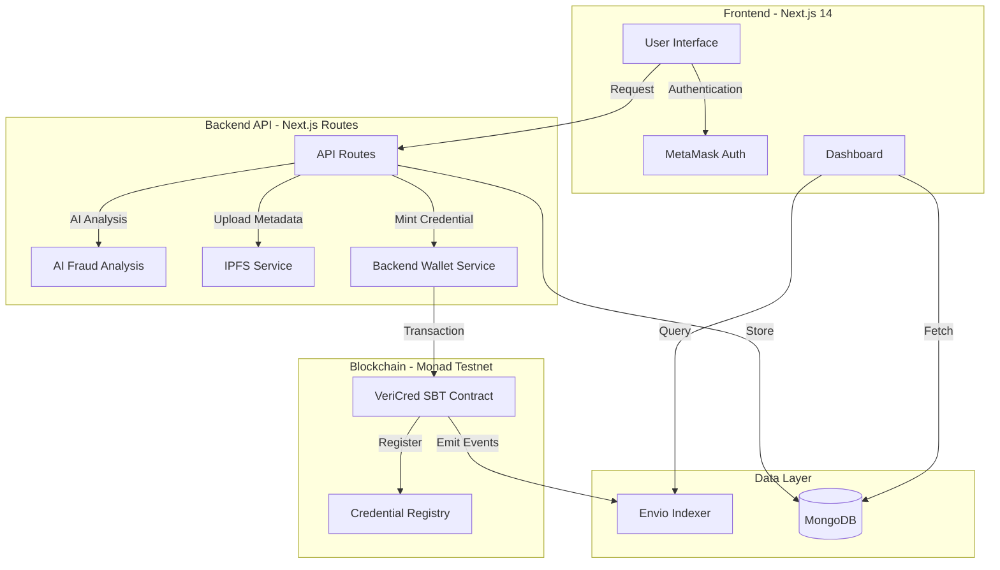
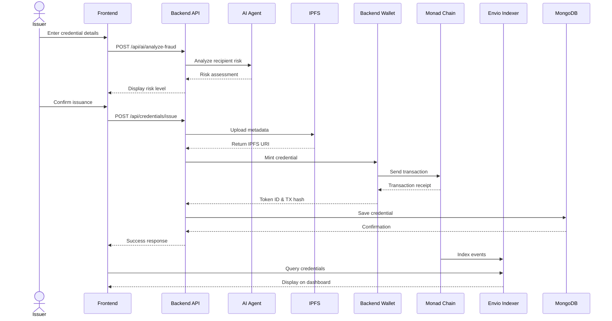
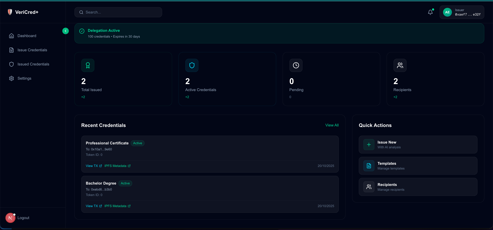
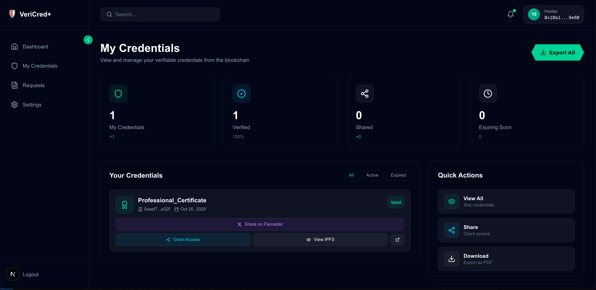
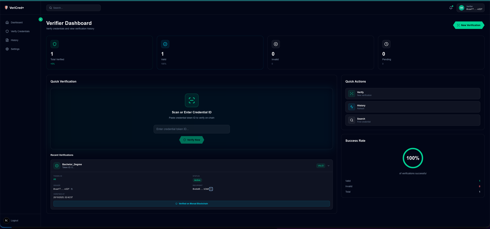
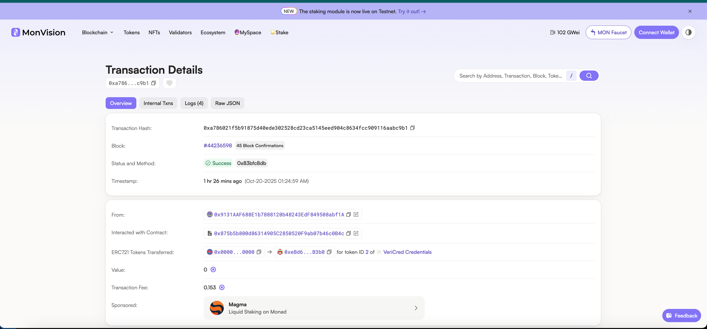
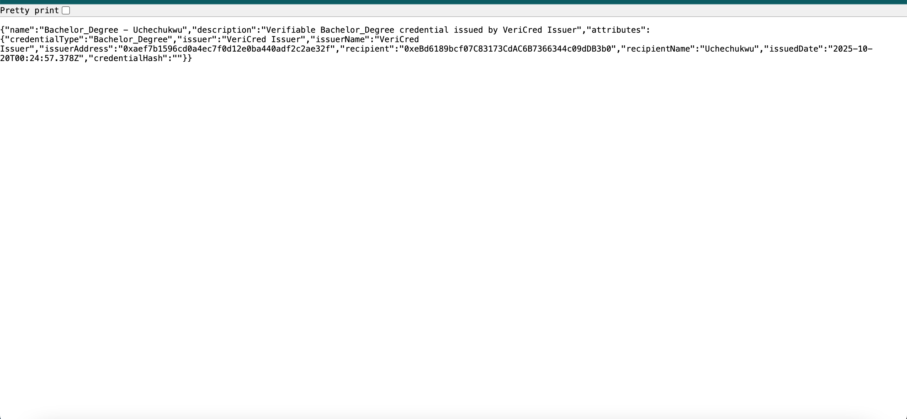
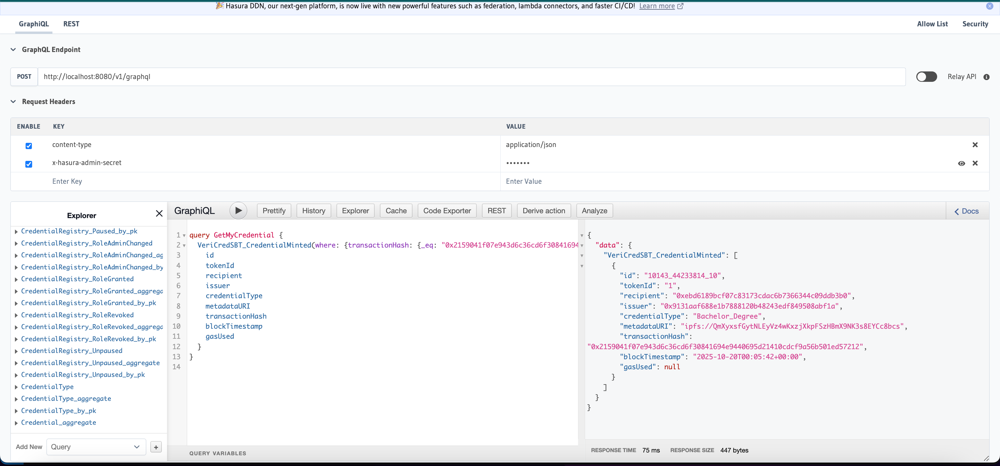
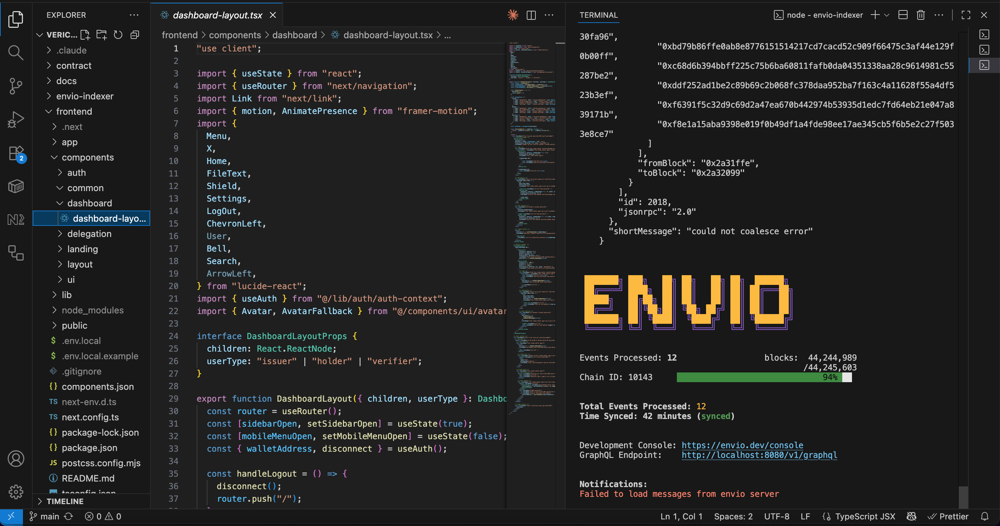

# VeriCred+ 🎓

**Delegated, Tamper-Proof Credential Management with AI Oversight**

Built for MetaMask x Monad x Envio Hackathon

---

## 🌟 Overview

VeriCred+ is a next-generation credential issuance and verification system that leverages **MetaMask Smart Account Delegation**, **Monad blockchain**, and **Envio indexer** to create a seamless, fraud-resistant credential management platform.

### Problem
- Credential fraud is a multi-billion dollar problem
- Traditional verification is slow, manual, and susceptible to forgery
- Web3 onboarding is too complex for non-technical users

### Solution
A seamless dApp that allows institutions to issue credentials as Soulbound NFTs via delegated smart accounts, with AI-powered fraud analysis, all verified instantly on the Monad blockchain.

---

## 🏗️ System Architecture



---

## 🔄 Credential Issuance Flow



---

## 🎯 Key Features

### 1. **MetaMask Smart Account Integration**
- Seamless wallet authentication
- 30-minute signature caching for smooth UX
- No repeated popups during demo

### 2. **Delegation-Based Issuance**
- Issuer delegates minting permissions to backend
- Backend wallet executes transactions with ISSUER_ROLE
- Tracks delegation usage and expiration

### 3. **AI-Powered Fraud Detection**
- Real-time risk analysis before credential issuance
- Analyzes recipient wallet history
- Provides risk scores and recommendations

### 4. **Soulbound Credentials (SBT)**
- Non-transferable credentials stored on-chain
- Immutable and verifiable
- Supports expiration and revocation

### 5. **IPFS Metadata Storage**
- Decentralized storage for credential details
- Verifiable off-chain data
- Permanent and censorship-resistant

### 6. **Envio Indexer Integration**
- Real-time blockchain event indexing
- Fast GraphQL queries
- Dashboard statistics and history

### 7. **Social Sharing (Farcaster)**
- Share credentials on social media
- Verifiable frames for credential display
- Instant on-chain verification

---

## 🖼️ Screenshots

### Issuer Dashboard

*Issue credentials with AI fraud analysis and delegation management*

### Holder Dashboard

*View and share your credentials with Farcaster integration*

### Verifier Dashboard

*Verify credentials instantly with expandable verification history*

### Monad Testnet Transaction

*On-chain credential transactions on Monad blockchain*

### IPFS Metadata

*Decentralized credential metadata storage*

### Envio Indexer

*Real-time blockchain event indexing and GraphQL interface*

### Envio Running Locally

*Envio indexer running locally during development (hosted deployment not available)*

---

## 🚀 Tech Stack

| Layer | Technology |
|-------|-----------|
| **Frontend** | Next.js 14, TypeScript, TailwindCSS, Framer Motion |
| **Authentication** | MetaMask, Signature-based auth |
| **Smart Contracts** | Solidity, VeriCred SBT Contract |
| **Blockchain** | Monad Testnet (Chain ID: 10143) |
| **Indexer** | Envio HyperIndex |
| **Database** | MongoDB |
| **Storage** | IPFS (Pinata) |
| **AI** | OpenAI GPT-4o |
| **Deployment** | Vercel (Frontend), Monad Testnet (Contracts) |

---

## 📋 Prerequisites

- Node.js 18+
- MongoDB
- MetaMask wallet
- Monad testnet MON tokens
- Pinata IPFS account
- OpenAI API key

---

## ⚙️ Environment Setup

Create `.env.local` in the frontend directory:

```env
# MongoDB
MONGODB_URI=mongodb://localhost:27017/vericred

# Blockchain
NEXT_PUBLIC_VERICRED_SBT_ADDRESS=0x...
NEXT_PUBLIC_CREDENTIAL_REGISTRY_ADDRESS=0x...
BACKEND_WALLET_PRIVATE_KEY=0x...

# IPFS
PINATA_API_KEY=...
PINATA_SECRET_KEY=...

# AI
OPENAI_API_KEY=sk-...

# App
NEXT_PUBLIC_APP_URL=http://localhost:3000
NEXT_PUBLIC_BACKEND_URL=http://localhost:3001
NEXT_PUBLIC_ENVIO_GRAPHQL_URL=http://localhost:8080/v1/graphql
```

---

## 🏃 Quick Start

### 1. Install Dependencies
```bash
# Frontend
cd frontend
npm install

# Envio Indexer
cd ../envio-indexer
npm install -g envio
```

### 2. Start MongoDB
```bash
mongod --dbpath=/path/to/data
```

### 3. Start Envio Indexer
```bash
cd envio-indexer
envio dev
```

### 4. Start Frontend
```bash
cd frontend
npm run dev
```

Visit `http://localhost:3000`

---

## 📖 User Flows

### As an Issuer (University Registrar)
1. Connect MetaMask wallet
2. Set up delegation (one-time)
3. Enter recipient details and credential type
4. Run AI fraud analysis
5. Issue credential (signed by backend wallet)
6. View issued credentials on dashboard

### As a Holder (Graduate)
1. Connect MetaMask wallet
2. View all received credentials
3. Share credentials on Farcaster
4. Access IPFS metadata and transaction details

### As a Verifier (HR Manager)
1. Connect MetaMask wallet (optional)
2. Enter credential token ID
3. View verification result with full details
4. Verification history is saved and displayed
5. Click to expand recent verifications for details

---

## 🔑 Key Technical Decisions

### Why Delegation?
- Issuers don't pay gas fees for each credential
- Backend wallet with ISSUER_ROLE executes transactions
- Tracks usage limits and expiration per delegation

### Why Monad?
- High performance EVM-compatible chain
- Low transaction costs
- Growing ecosystem

### Why Envio?
- Real-time event indexing
- GraphQL API for fast queries
- Better than polling blockchain directly

### Why MongoDB + Envio?
- MongoDB: Primary database for credentials and verifications
- Envio: Blockchain event indexing and validation
- Dual approach ensures data availability

---

## 🛠️ Smart Contract Details

**VeriCred SBT Contract:**
- ERC721-based Soulbound Token
- Non-transferable credentials
- Role-based access control
- Supports credential revocation
- Expiration timestamps
- Event emission for Envio indexing

**Credential Registry:**
- On-chain registry of issued credentials
- Integration with SBT contract
- Tracks issuer relationships

---

## 📊 Envio Configuration

```yaml
networks:
  - id: 10143 # Monad Testnet
    start_block: 44233810
    rpc_config:
      url: https://testnet-rpc.monad.xyz

contracts:
  - name: VeriCredSBT
    address: [0x...]
    abi_file_path: abis/vericred-sbt.json
    handler: src/EventHandlers.ts
    events:
      - event: CredentialMinted
      - event: CredentialRevoked
```

---

## 🎥 Demo Video Script

**Duration:** 3 minutes

1. **Intro (15s)** - Problem statement and solution overview
2. **Issuer Flow (60s)** - Delegation setup, AI analysis, credential issuance
3. **Holder Flow (45s)** - View credentials, Farcaster sharing
4. **Verifier Flow (30s)** - Instant verification with expandable history
5. **Technical Deep Dive (30s)** - Show Envio, IPFS, Monad explorer, MongoDB
6. **Outro (10s)** - Impact and call to action

---

## 🏆 Hackathon Tracks

### Primary Tracks
- ✅ **Best AI Agent** - AI fraud analysis integration
- ✅ **Best On-Chain Automation** - Delegation-based issuance
- ✅ **Best Consumer Application** - Seamless UX for all user types

### Bounties
- ✅ **Most Innovative Use of Delegations** - Backend wallet delegation
- ✅ **Best Use of Envio** - Real-time indexing and GraphQL queries
- ✅ **Envio Bonus** - Complete integration with event handlers

---

## 🐛 Known Issues & Fixes

### Token ID showing as 0
**Fixed:** Updated event log parsing to correctly extract tokenId from `CredentialMinted` event using proper event signature.

### Verifier stats not updating
**Fixed:** Verification logging now always executes after verification, regardless of result. History is fetched and displayed properly.

### MetaMask popup on every action
**Fixed:** Implemented 30-minute signature caching to prevent repeated authentication popups.

---

## 📝 License

MIT License - Built for MetaMask x Monad x Envio Hackathon 2025

---

## 🙏 Acknowledgments

- MetaMask team for Smart Account Delegation
- Monad team for high-performance blockchain
- Envio team for real-time indexing infrastructure
- OpenAI for fraud detection capabilities

---

## 📞 Contact

For questions or demo requests, please open an issue in this repository.

**Built with ❤️ for the future of verifiable credentials**
