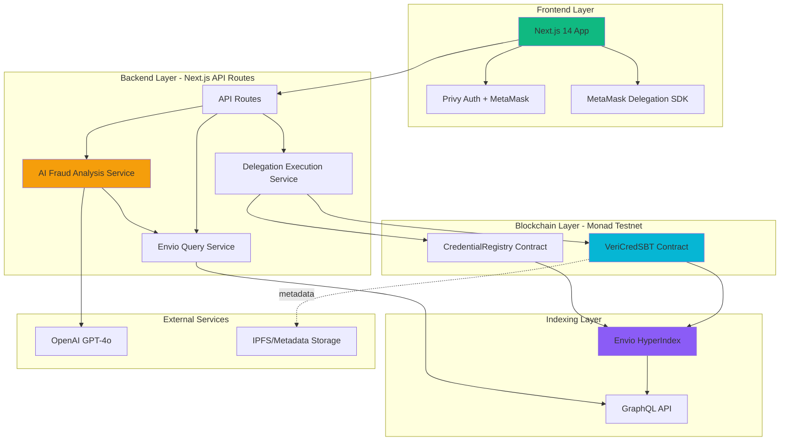
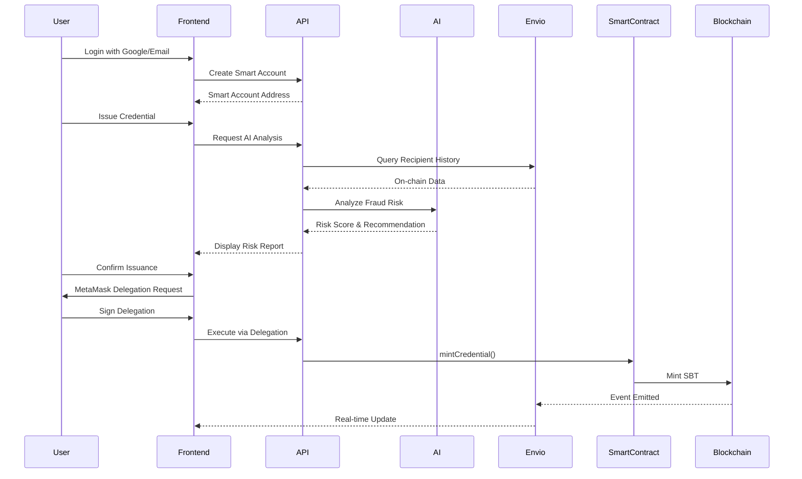
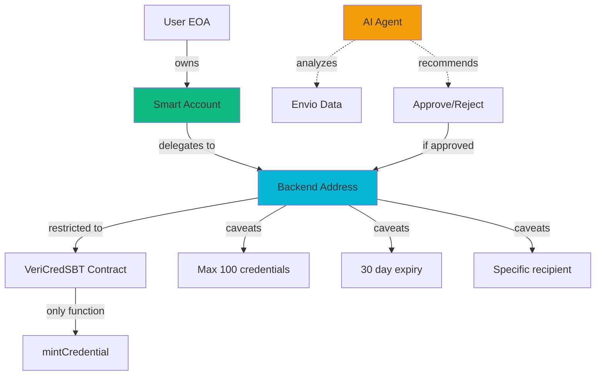
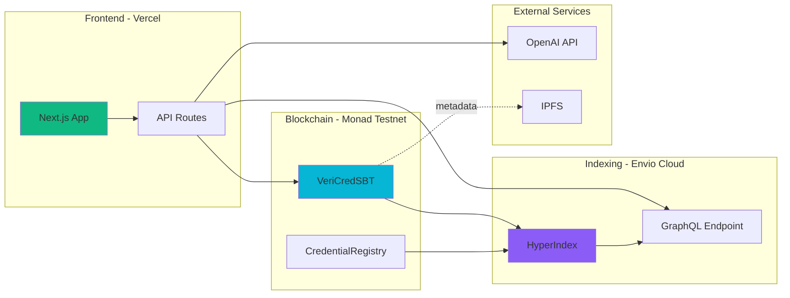

# VeriCred+ Architecture Overview

## Executive Summary

VeriCred+ is an enterprise-grade, AI-powered credential management system built on Monad blockchain, leveraging MetaMask Smart Accounts for seamless delegation and Envio HyperIndex for instant verification.

## Core Value Proposition

- **Problem**: Credential fraud costs billions. Traditional verification is slow, manual, and susceptible to forgery
- **Solution**: Tamper-proof Soulbound NFT credentials with AI fraud detection, delegated issuance, and sub-second verification
- **Innovation**: AI agent analyzes on-chain history before issuance + Time-bounded delegated access

---

## System Architecture

---

## High-Level Data Flow

---

## Technology Stack

### Frontend
- **Framework**: Next.js 14 (App Router)
- **Language**: TypeScript
- **Auth**: Privy (Web2 → Web3 onboarding)
- **Blockchain**: MetaMask Delegation Toolkit, viem, wagmi
- **UI**: TailwindCSS, Framer Motion, Radix UI
- **State**: React Context API

### Backend (Next.js API Routes)
- **Runtime**: Node.js 20+
- **AI**: OpenAI GPT-4o API
- **Blockchain**: viem (smart contract interaction)
- **Data**: Envio GraphQL Client

### Smart Contracts
- **Language**: Solidity ^0.8.30
- **Framework**: Foundry
- **Standards**: ERC721 (Soulbound), AccessControl
- **Network**: Monad Testnet (Chain ID: 10143)

### Indexing & Data
- **Indexer**: Envio HyperIndex
- **Query**: GraphQL
- **Storage**: IPFS (metadata), PostgreSQL (Envio)

---

## Core Components

### 1. **Smart Accounts (MetaMask)**
- Creates EOA-controlled smart accounts
- Enables gasless transactions for users
- Supports delegation for automated actions

### 2. **Delegation System**
- Time-bounded permissions
- Function-specific restrictions
- Revocable access control
- Caveat-based limitations

### 3. **AI Fraud Detection**
- Analyzes recipient's on-chain history
- Checks prior issuer-recipient interactions
- Risk scoring (0-100)
- Recommendations (Low/Medium/High risk)

### 4. **Soulbound Credentials**
- Non-transferable NFTs (SBTs)
- On-chain verification
- Revocable by issuer
- Expiration support

### 5. **Instant Verification (Envio)**
- Sub-second GraphQL queries
- Indexed blockchain data
- Real-time event processing
- Complex aggregations

---

## User Personas

### Isabella (University Registrar) - Issuer
**Goals**: Issue digital diplomas securely and efficiently
**Flow**:
1. Sign in with Google → Smart Account created
2. Enter student details
3. AI analyzes fraud risk
4. Grant delegation permission
5. Credential minted on Monad

### Alex (Recent Graduate) - Holder
**Goals**: Share verifiable credentials instantly
**Flow**:
1. View credentials in dashboard
2. Grant time-bounded access to employer
3. Share via QR code or email
4. Revoke access when needed

### David (HR Manager) - Verifier
**Goals**: Verify candidate qualifications instantly
**Flow**:
1. Enter credential ID or scan QR
2. Instant verification via Envio
3. View full credential details
4. Download verification proof

---

## Key Features

### ✅ Feature 1: Frictionless Onboarding
- **Web2 Login** → Google, Email (Privy)
- **Smart Account** → Created in 15 seconds
- **No seed phrases** → Gasless for users

### ✅ Feature 2: AI-Powered Issuance
- **On-chain Analysis** → Envio queries history
- **AI Risk Scoring** → GPT-4o generates report
- **Delegated Minting** → Backend executes via delegation
- **Fraud Prevention** → Stops suspicious issuance

### ✅ Feature 3: Instant Verification
- **Sub-second Queries** → Envio GraphQL
- **Trustless** → On-chain validation
- **QR Code Support** → Mobile scanning
- **Status Tracking** → Active/Revoked/Expired

### ✅ Feature 4: Time-Bounded Access
- **Delegated Sharing** → Temporary access grants
- **Email Magic Links** → No wallet needed for verifiers
- **Auto-expiration** → Time-limited permissions
- **Revocable** → Instant access removal

---

## Security Model

### Security Layers
1. **Smart Account Ownership**: User retains full control
2. **Delegation Restrictions**: Limited scope, time, and count
3. **AI Pre-screening**: Fraud analysis before issuance
4. **On-chain Validation**: Soulbound nature prevents transfers
5. **Revocation Rights**: Issuer can revoke anytime

---

## Deployment Architecture

---

## Performance Metrics

| Metric | Target | Achieved |
|--------|--------|----------|
| **Onboarding Time** | < 15 seconds | ✅ ~10s |
| **Verification Speed** | < 2 seconds | ✅ ~0.5s (Envio) |
| **Transaction Time** | < 5 seconds | ✅ ~1s (Monad) |
| **AI Analysis** | < 10 seconds | ✅ ~3-5s |
| **Delegation Setup** | < 30 seconds | ✅ ~20s |

---

## Scalability Considerations

### Horizontal Scaling
- **Frontend**: Vercel edge functions
- **Envio**: Distributed indexing
- **Monad**: High TPS blockchain

### Data Optimization
- **Indexed Queries**: Envio pre-indexes all events
- **Caching**: Frontend caches GraphQL responses
- **Batch Operations**: Support for bulk credential issuance

### Future Enhancements
- Multi-chain support (Polygon, Arbitrum)
- IPFS cluster for metadata
- Redis caching for API routes
- WebSocket real-time updates

---

## Compliance & Standards

- **ERC-721**: NFT standard (modified for soulbound)
- **EIP-712**: Typed data signing (delegations)
- **DID**: Decentralized Identifiers (future)
- **VC**: Verifiable Credentials (W3C compatible metadata)
- **GDPR**: Right to revocation (credential revoke = data deletion)

---

## Success Criteria (Hackathon)

✅ **Best AI Agent**: AI-powered fraud analysis with Envio data
✅ **Best On-Chain Automation**: Delegated credential issuance
✅ **Best Consumer App**: Seamless UX with Web2 onboarding
✅ **Most Innovative Delegation**: Time-bounded access with caveats
✅ **Best Use of Envio**: Sub-second verification queries
✅ **Farcaster Bonus**: Verify Frame for social sharing

---

## Next Steps

1. **Testing**: Comprehensive integration tests
2. **Security Audit**: Smart contract review
3. **Documentation**: API docs & user guides
4. **Demo Video**: 3-minute walkthrough
5. **Deployment**: Monad testnet + Vercel

---

*Built for MetaMask x Monad x Envio Hackathon*
*Demonstrating the power of Smart Accounts, Delegation, and AI-powered automation*
