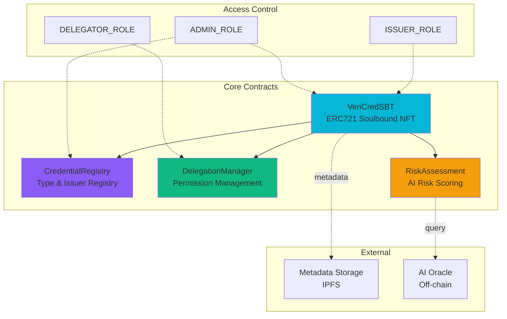
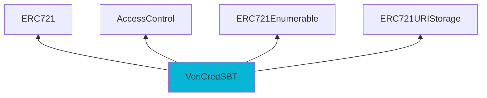
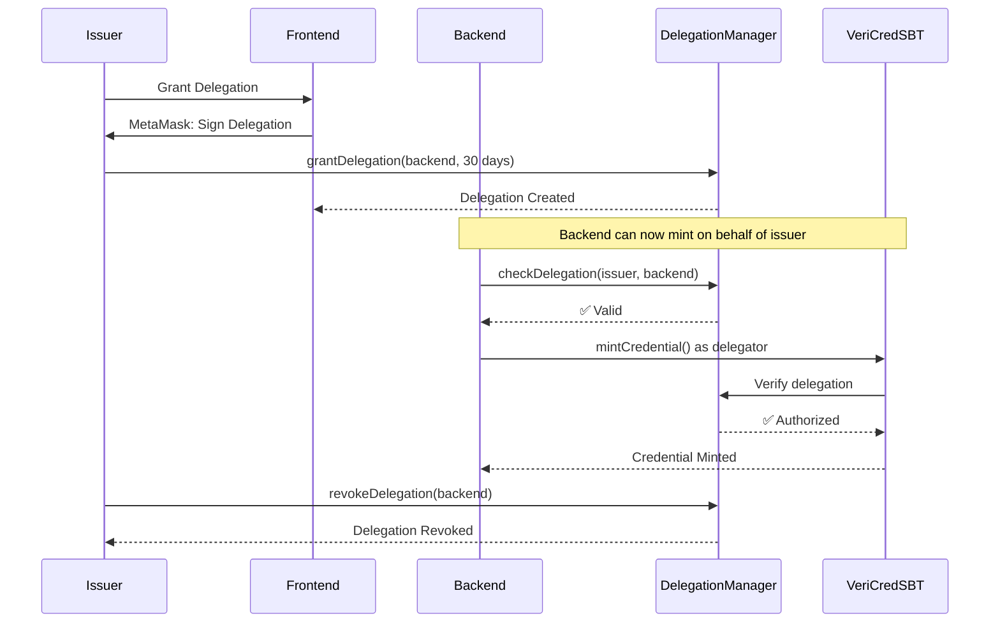
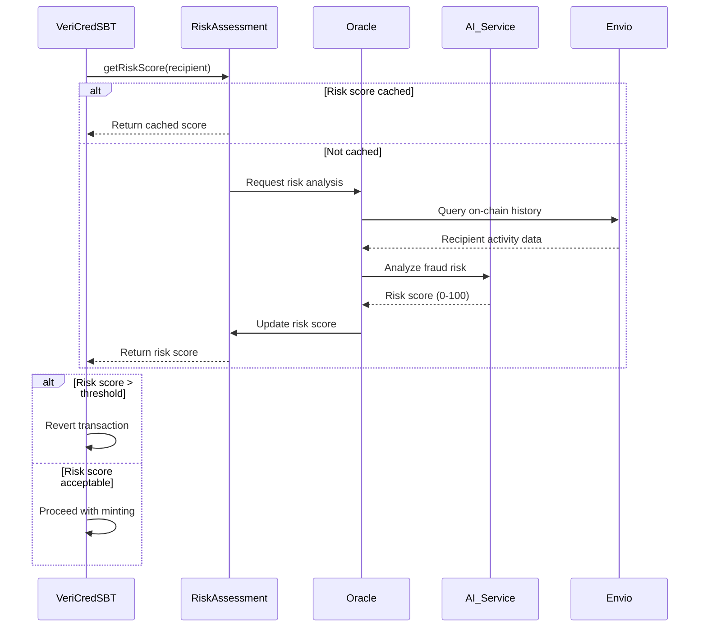

# VeriCred+ Smart Contracts Documentation

## Overview

VeriCred+ uses a modular smart contract architecture on Monad Testnet (Chain ID: 10143) to implement tamper-proof, soulbound credential NFTs with delegated issuance and AI-powered risk assessment.

---

## Contract Architecture



---

## 1. VeriCredSBT.sol

### Purpose
Main NFT contract implementing ERC-721 with Soulbound (non-transferable) characteristics for credential issuance.

### Key Features
- ✅ **Soulbound**: Non-transferable after minting
- ✅ **Role-Based Access**: ISSUER_ROLE, DELEGATOR_ROLE, ADMIN_ROLE
- ✅ **Delegated Minting**: Backend can mint via delegation
- ✅ **Revocation**: Issuer can revoke credentials
- ✅ **Risk Integration**: Optional AI risk assessment before minting
- ✅ **Metadata**: IPFS URI for credential details

### Contract Inheritance



### Core Functions

#### mintCredential()
```solidity
function mintCredential(
    address recipient,
    string memory credentialType,
    string memory metadataURI,
    uint256 expirationDate,
    uint256 credentialHash
) public onlyRole(ISSUER_ROLE) returns (uint256)
```

**Purpose**: Mint a new soulbound credential NFT

**Parameters**:
- `recipient`: Address that will own the credential
- `credentialType`: Type identifier (e.g., "DEGREE", "LICENSE")
- `metadataURI`: IPFS URI containing credential details
- `expirationDate`: Unix timestamp (0 = no expiration)
- `credentialHash`: Hash of credential data for tamper detection

**Access Control**: Only ISSUER_ROLE or DELEGATOR_ROLE

**Events Emitted**: `CredentialMinted(uint256 tokenId, address recipient, address issuer, string credentialType, string metadataURI, uint256 issuanceDate, uint256 expirationDate, uint256 credentialHash)`

**Flow**:
1. Verify caller has ISSUER_ROLE or DELEGATOR_ROLE
2. Check if Risk Assessment is enabled
3. If enabled, query RiskAssessment contract for risk score
4. If risk score > threshold, revert with "High risk recipient"
5. Increment tokenId counter
6. Mint NFT to recipient
7. Store credential metadata
8. Emit CredentialMinted event
9. Register with CredentialRegistry

**Example Usage**:
```typescript
const tx = await veriCredSBT.mintCredential(
  "0x123...", // recipient
  "UNIVERSITY_DEGREE",
  "ipfs://QmXyz...",
  1735689600, // Jan 1, 2025
  "0xabcd1234..." // credential hash
);
```

#### revokeCredential()
```solidity
function revokeCredential(
    uint256 tokenId,
    string memory reason
) public
```

**Purpose**: Revoke an active credential

**Access Control**: Only original issuer or ADMIN_ROLE

**Events Emitted**: `CredentialRevoked(uint256 tokenId, address revoker, string reason, uint256 revokedAt)`

**Flow**:
1. Verify credential exists and is active
2. Verify caller is original issuer or admin
3. Mark credential as revoked
4. Store revocation reason and timestamp
5. Update CredentialRegistry status
6. Emit CredentialRevoked event

#### _update() - Soulbound Implementation
```solidity
function _update(
    address to,
    uint256 tokenId,
    address auth
) internal override returns (address)
```

**Purpose**: Override ERC721 transfer logic to enforce soulbound nature

**Critical Logic**:
```solidity
address from = _ownerOf(tokenId);

// Allow minting (from = address(0)) and burning (to = address(0))
// Prevent all other transfers (SOULBOUND)
if (from != address(0) && to != address(0)) {
    revert SoulboundTokenNotTransferable();
}

return super._update(to, tokenId, auth);
```

**Result**: Credentials cannot be transferred between addresses after minting

### State Variables

```solidity
// Credential metadata
struct CredentialData {
    string credentialType;
    address issuer;
    uint256 issuanceDate;
    uint256 expirationDate;
    uint256 credentialHash;
    bool isRevoked;
    string revocationReason;
    uint256 revokedAt;
}

mapping(uint256 => CredentialData) public credentials;
uint256 private _tokenIdCounter;

// Contract references
ICredentialRegistry public credentialRegistry;
IDelegationManager public delegationManager;
IRiskAssessment public riskAssessment;

// Configuration
bool public riskAssessmentEnabled;
uint256 public riskThreshold; // 0-100
```

### Access Control Roles

```solidity
bytes32 public constant ISSUER_ROLE = keccak256("ISSUER_ROLE");
bytes32 public constant DELEGATOR_ROLE = keccak256("DELEGATOR_ROLE");
bytes32 public constant ADMIN_ROLE = DEFAULT_ADMIN_ROLE;
```

**Role Permissions**:
- **ISSUER_ROLE**: Can mint and revoke credentials
- **DELEGATOR_ROLE**: Can mint credentials via delegation (granted to backend)
- **ADMIN_ROLE**: Full control, can grant/revoke roles, update configuration

### Events

```solidity
event CredentialMinted(
    uint256 indexed tokenId,
    address indexed recipient,
    address indexed issuer,
    string credentialType,
    string metadataURI,
    uint256 issuanceDate,
    uint256 expirationDate,
    uint256 credentialHash
);

event CredentialRevoked(
    uint256 indexed tokenId,
    address indexed revoker,
    string reason,
    uint256 revokedAt
);

event DelegationGranted(
    address indexed issuer,
    address indexed delegate,
    uint256 expiresAt
);

event DelegationRevoked(
    address indexed issuer,
    address indexed delegate
);
```

---

## 2. CredentialRegistry.sol

### Purpose
Central registry for managing credential types, verified issuers, and credential status tracking.

### Key Features
- ✅ **Credential Type Management**: Define valid credential types
- ✅ **Issuer Verification**: Track verified issuers
- ✅ **Status Tracking**: Monitor credential lifecycle
- ✅ **Statistics**: Count total/active/revoked credentials

### Core Functions

#### registerCredentialType()
```solidity
function registerCredentialType(
    string memory typeName,
    string memory description,
    uint256 defaultValidityPeriod
) public onlyRole(ADMIN_ROLE)
```

**Purpose**: Register a new credential type (e.g., "DEGREE", "LICENSE")

**Example**:
```solidity
credentialRegistry.registerCredentialType(
    "UNIVERSITY_DEGREE",
    "Academic degree from accredited university",
    157680000 // 5 years in seconds
);
```

#### registerIssuer()
```solidity
function registerIssuer(
    address issuer,
    string memory name,
    string memory logoURI,
    string memory websiteURI,
    string[] memory authorizedTypes
) public onlyRole(ADMIN_ROLE)
```

**Purpose**: Register and verify a new credential issuer

**Parameters**:
- `issuer`: Issuer's address
- `name`: Organization name
- `logoURI`: IPFS URI for logo
- `websiteURI`: Official website
- `authorizedTypes`: Array of credential types issuer can issue

#### recordCredential()
```solidity
function recordCredential(
    uint256 tokenId,
    address recipient,
    address issuer,
    string memory credentialType
) external onlySBTContract
```

**Purpose**: Called by VeriCredSBT when minting to record credential in registry

**Access Control**: Only callable by VeriCredSBT contract

### State Variables

```solidity
struct CredentialType {
    string name;
    string description;
    uint256 defaultValidityPeriod;
    bool isActive;
    uint256 totalIssued;
}

struct IssuerInfo {
    string name;
    bool isVerified;
    uint256 registeredAt;
    string logoURI;
    string websiteURI;
    mapping(string => bool) authorizedTypes;
    uint256 totalCredentialsIssued;
    uint256 totalActiveCredentials;
}

mapping(string => CredentialType) public credentialTypes;
mapping(address => IssuerInfo) public issuers;
mapping(uint256 => bool) public credentialExists;
```

---

## 3. DelegationManager.sol

### Purpose
Manages time-bounded, scope-limited delegation permissions for credential issuance.

### Key Features
- ✅ **Time-Bounded**: Delegations expire after set period
- ✅ **Scope-Limited**: Restrict to specific functions/contracts
- ✅ **Revocable**: Issuer can revoke delegation anytime
- ✅ **Call Limits**: Maximum number of delegated calls

### Delegation Lifecycle



### Core Functions

#### grantDelegation()
```solidity
function grantDelegation(
    address delegate,
    uint256 duration,
    uint256 maxCalls
) public
```

**Purpose**: Grant delegation permission to another address

**Parameters**:
- `delegate`: Address to grant permission (usually backend)
- `duration`: How long delegation lasts (seconds)
- `maxCalls`: Maximum credential mints allowed

#### checkDelegation()
```solidity
function checkDelegation(
    address issuer,
    address delegate
) public view returns (bool isValid, uint256 callsRemaining)
```

**Purpose**: Verify if delegation is still valid

**Returns**:
- `isValid`: true if delegation exists and not expired
- `callsRemaining`: Number of calls left

### State Variables

```solidity
struct Delegation {
    address issuer;
    address delegate;
    uint256 grantedAt;
    uint256 expiresAt;
    uint256 maxCalls;
    uint256 callsUsed;
    bool isRevoked;
}

mapping(address => mapping(address => Delegation)) public delegations;
```

---

## 4. RiskAssessment.sol

### Purpose
Oracle contract for AI-powered fraud risk scoring before credential issuance.

### Key Features
- ✅ **Off-chain AI Integration**: Connects to OpenAI API via oracle
- ✅ **Risk Scoring**: 0-100 risk score based on on-chain history
- ✅ **Threshold Enforcement**: Reject high-risk recipients
- ✅ **Cache Results**: Store risk assessments to save gas

### Risk Assessment Flow



### Core Functions

#### getRiskScore()
```solidity
function getRiskScore(address recipient)
    public view returns (uint256 score, uint256 assessedAt)
```

**Purpose**: Get cached risk score or trigger new assessment

#### updateRiskScore()
```solidity
function updateRiskScore(
    address recipient,
    uint256 score,
    string memory analysis
) public onlyOracle
```

**Purpose**: Oracle updates risk score after AI analysis

**Access Control**: Only callable by authorized oracle address

### State Variables

```solidity
struct RiskData {
    uint256 score;          // 0-100
    uint256 assessedAt;     // Timestamp
    string analysis;        // AI explanation
    uint256 cacheExpiry;    // When to re-assess
}

mapping(address => RiskData) public riskScores;
address public oracleAddress;
uint256 public defaultCacheDuration = 7 days;
```

---

## Deployment

### Monad Testnet Configuration

```solidity
// Chain ID: 10143
// RPC: https://testnet.monad.network
// Explorer: https://explorer-testnet.monad.xyz
```

### Deployment Order

1. **CredentialRegistry** (no dependencies)
2. **RiskAssessment** (no dependencies)
3. **DelegationManager** (no dependencies)
4. **VeriCredSBT** (depends on all above)

### Deployment Script (Foundry)

```bash
# Set environment variables
export MONAD_TESTNET_RPC="https://testnet.monad.network"
export DEPLOYER_PRIVATE_KEY="..."

# Deploy contracts
forge script script/Deploy.s.sol:DeployScript \
  --rpc-url $MONAD_TESTNET_RPC \
  --private-key $DEPLOYER_PRIVATE_KEY \
  --broadcast \
  --verify

# Save deployed addresses
# VeriCredSBT: 0x...
# CredentialRegistry: 0x...
# DelegationManager: 0x...
# RiskAssessment: 0x...
```

---

## Security Considerations

### Access Control
- All admin functions protected by role checks
- Role assignment requires existing admin approval
- Two-step role transfer for admin role

### Soulbound Enforcement
- Transfer blocked at ERC721 `_update()` level
- Cannot be bypassed by approve/transferFrom
- Only minting and burning allowed

### Delegation Safety
- Time-bounded expiration prevents indefinite access
- Call limits prevent bulk abuse
- Issuer can revoke anytime
- Delegation scoped to specific contract + function

### Risk Assessment
- Optional feature, can be disabled
- Configurable threshold per issuer preferences
- Oracle address must be trusted
- Cache prevents re-assessment spam

### Reentrancy Protection
- All state changes before external calls
- No ether transfers in critical paths
- Registry calls use pull pattern

---

## Gas Optimization

### mintCredential()
- **Estimated Gas**: ~150,000 gas
- **Optimizations**:
  - Packed storage for CredentialData
  - Single SSTORE for credential metadata
  - Efficient role checks using bitmap

### revokeCredential()
- **Estimated Gas**: ~50,000 gas
- **Optimizations**:
  - Minimal storage updates
  - No token burning (preserves history)

### Batch Operations
Future enhancement: `mintCredentialBatch()` for bulk issuance with ~30% gas savings per credential.

---

## Testing

### Unit Tests (Foundry)

```bash
# Run all tests
forge test

# Run with gas report
forge test --gas-report

# Run specific test
forge test --match-test testMintCredential

# Coverage
forge coverage
```

### Test Coverage Targets
- ✅ Minting: Normal, reverted, delegated
- ✅ Revocation: By issuer, by admin, by non-authorized
- ✅ Transfer: Blocked after mint, allowed during mint
- ✅ Delegation: Grant, revoke, expiry, call limits
- ✅ Risk Assessment: Accept, reject, cached, expired
- ✅ Access Control: Role checks, unauthorized access

---

## Integration with Frontend

### Contract ABIs
Located in `/frontend/lib/contracts/abis/`

```typescript
import VeriCredSBTABI from '@/lib/contracts/abis/VeriCredSBT.json';
import CredentialRegistryABI from '@/lib/contracts/abis/CredentialRegistry.json';
```

### Contract Addresses
Configured in `.env.local`:

```bash
NEXT_PUBLIC_VERICRED_SBT_ADDRESS=0x...
NEXT_PUBLIC_CREDENTIAL_REGISTRY_ADDRESS=0x...
NEXT_PUBLIC_DELEGATION_MANAGER_ADDRESS=0x...
```

### Example: Mint Credential via Delegation

```typescript
import { createWalletClient, http } from 'viem';
import { monadTestnet } from '@/lib/delegation/chains';
import VeriCredSBTABI from '@/lib/contracts/abis/VeriCredSBT.json';

// Backend calls contract via delegation
const walletClient = createWalletClient({
  chain: monadTestnet,
  transport: http(),
  account: backendPrivateKey,
});

const { hash } = await walletClient.writeContract({
  address: process.env.VERICRED_SBT_ADDRESS,
  abi: VeriCredSBTABI,
  functionName: 'mintCredential',
  args: [
    recipientAddress,
    'UNIVERSITY_DEGREE',
    'ipfs://QmXyz...',
    1735689600,
    credentialHash,
  ],
});

console.log('Credential minted:', hash);
```

---

## Verification

### Block Explorer
View contracts on [Monad Testnet Explorer](https://explorer-testnet.monad.xyz)

### Verify Source Code

```bash
forge verify-contract \
  --chain-id 10143 \
  --compiler-version 0.8.30 \
  ADDRESS \
  src/contracts/VeriCredSBT.sol:VeriCredSBT
```

---

*Smart contracts implement ERC-721, AccessControl, and custom Soulbound logic for tamper-proof credential management on Monad.*
