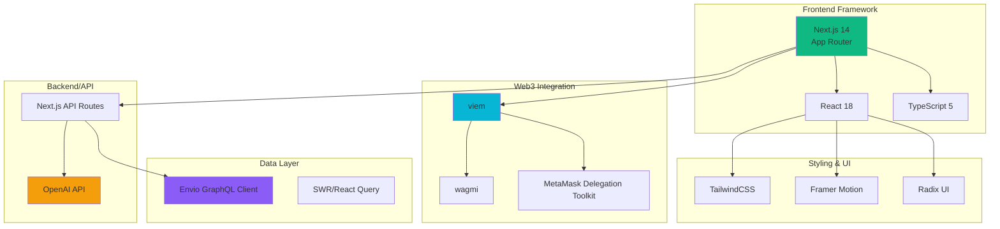
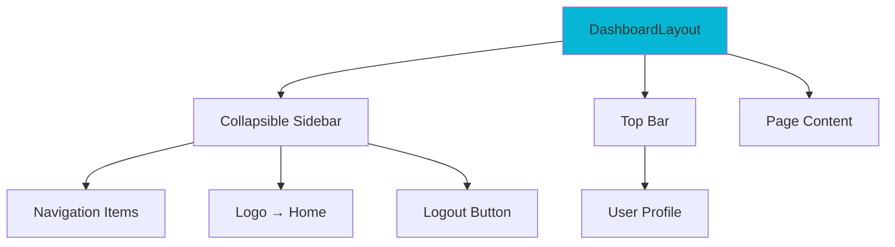
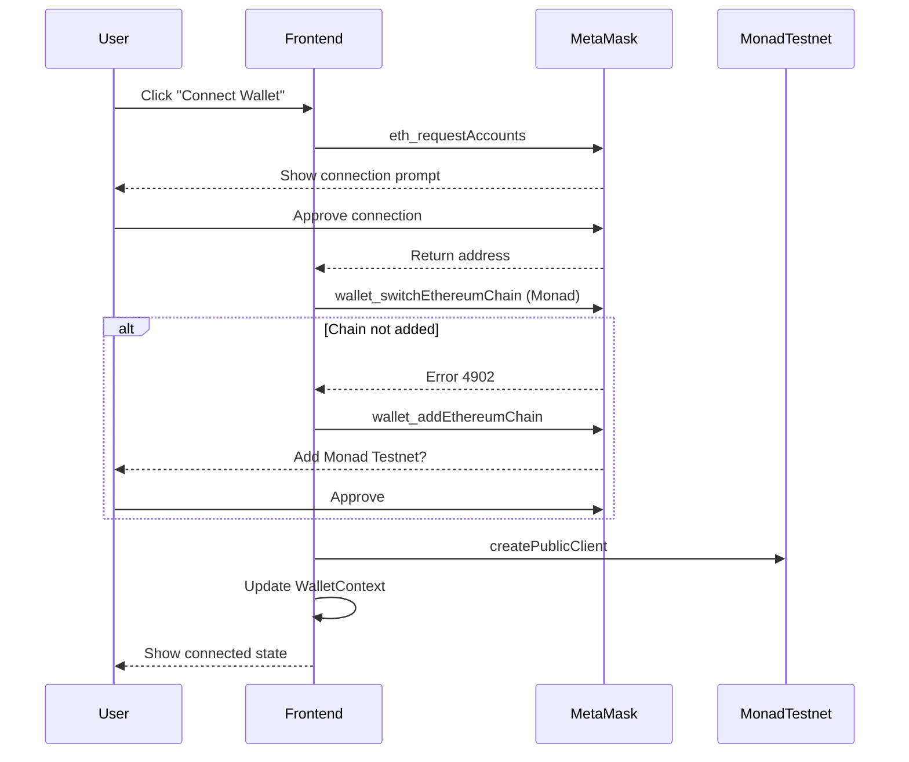
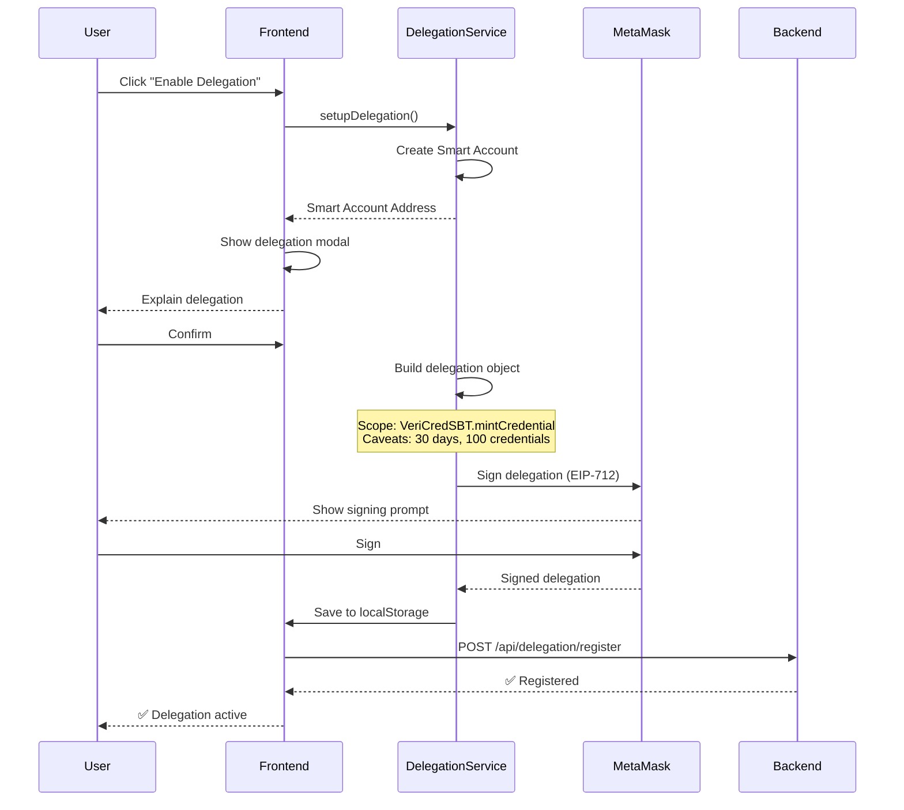

# VeriCred+ Frontend Architecture

## Overview

VeriCred+ frontend is built with Next.js 14 App Router, TypeScript, and TailwindCSS, providing a seamless Web3 experience with MetaMask integration and Envio GraphQL queries.

---

## Technology Stack



---

## Project Structure

```
frontend/
├── app/                          # Next.js App Router
│   ├── layout.tsx               # Root layout
│   ├── page.tsx                 # Landing page
│   ├── api/                     # API Routes (Backend)
│   │   ├── ai/
│   │   │   └── analyze-fraud/   # AI fraud analysis
│   │   ├── credentials/
│   │   │   ├── issue/          # Issue credential
│   │   │   ├── revoke/         # Revoke credential
│   │   │   └── verify/         # Verify credential
│   │   └── delegation/
│   │       └── execute/        # Execute delegated action
│   ├── issuer/                  # Issuer Dashboard
│   │   ├── layout.tsx
│   │   ├── page.tsx            # Dashboard home
│   │   ├── issue/              # Issue credential form
│   │   ├── credentials/        # View issued credentials
│   │   └── settings/           # Issuer settings
│   ├── holder/                  # Holder Dashboard
│   │   ├── layout.tsx
│   │   ├── page.tsx            # Dashboard home
│   │   ├── credentials/        # My credentials
│   │   ├── requests/           # Access requests
│   │   └── settings/           # Holder settings
│   └── verifier/                # Verifier Dashboard
│       ├── layout.tsx
│       ├── page.tsx            # Dashboard home
│       ├── verify/             # Verify credential
│       ├── history/            # Verification history
│       └── settings/           # Verifier settings
├── components/                  # React Components
│   ├── ui/                     # UI primitives (buttons, cards)
│   ├── dashboard/              # Dashboard components
│   │   └── dashboard-layout.tsx
│   ├── landing/                # Landing page sections
│   │   ├── hero.tsx
│   │   ├── features.tsx
│   │   └── cta.tsx
│   └── onboarding/             # Onboarding flows
│       ├── IssuerOnboarding.tsx
│       ├── HolderOnboarding.tsx
│       └── VerifierOnboarding.tsx
├── lib/                         # Core Libraries
│   ├── delegation/             # MetaMask Delegation
│   │   ├── wallet.ts           # Wallet connection
│   │   ├── delegation.service.ts # Delegation manager
│   │   ├── smart-account.ts    # Smart account creation
│   │   └── chains.ts           # Chain config (Monad)
│   ├── contracts/              # Contract interactions
│   │   ├── abis/              # Contract ABIs
│   │   └── vericred.ts        # Contract wrapper
│   └── server/                 # Server-side utilities
│       ├── envio.ts           # Envio GraphQL client
│       └── openai.ts          # OpenAI integration
├── hooks/                       # React Hooks
│   ├── useDelegation.ts       # Delegation hook
│   ├── useWallet.ts           # Wallet hook
│   └── useCredentials.ts      # Credential data hook
├── context/                     # React Context
│   └── WalletContext.tsx      # Global wallet state
└── public/                      # Static assets
    └── images/
```

---

## Routing Architecture

### Next.js App Router

VeriCred+ uses Next.js 14's App Router with file-based routing:

```mermaid
graph TD
    ROOT[/ Landing Page]

    ISSUER[/issuer Dashboard]
    ISSUE[/issuer/issue]
    CREDS[/issuer/credentials]
    ISET[/issuer/settings]

    HOLDER[/holder Dashboard]
    HCREDS[/holder/credentials]
    REQS[/holder/requests]
    HSET[/holder/settings]

    VERIFIER[/verifier Dashboard]
    VERIFY[/verifier/verify]
    HIST[/verifier/history]
    VSET[/verifier/settings]

    ROOT --> ISSUER
    ROOT --> HOLDER
    ROOT --> VERIFIER

    ISSUER --> ISSUE
    ISSUER --> CREDS
    ISSUER --> ISET

    HOLDER --> HCREDS
    HOLDER --> REQS
    HOLDER --> HSET

    VERIFIER --> VERIFY
    VERIFIER --> HIST
    VERIFIER --> VSET

    style ROOT fill:#10b981
    style ISSUER fill:#06b6d4
    style HOLDER fill:#8b5cf6
    style VERIFIER fill:#f59e0b
```

### Route Groups

- `/issuer/*` - Issuer persona routes
- `/holder/*` - Holder persona routes
- `/verifier/*` - Verifier persona routes
- `/api/*` - Backend API routes (Next.js server-side)

---

## Component Architecture

### Dashboard Layout Pattern

All three dashboards share the same layout component with different navigation items:



#### DashboardLayout Component

**Location**: [components/dashboard/dashboard-layout.tsx](../frontend/components/dashboard/dashboard-layout.tsx)

**Props**:
```typescript
interface DashboardLayoutProps {
  userType: "issuer" | "holder" | "verifier";
  navItems: NavItem[];
  children: React.ReactNode;
}

interface NavItem {
  name: string;
  href: string;
  icon: React.ComponentType<{ className?: string }>;
}
```

**Features**:
- Responsive sidebar (collapsible on mobile)
- Active route highlighting
- Wallet address display
- Logout with redirect to home
- Logo links to landing page

**Example Usage**:
```tsx
<DashboardLayout
  userType="issuer"
  navItems={[
    { name: "Dashboard", href: "/issuer", icon: LayoutDashboard },
    { name: "Issue Credential", href: "/issuer/issue", icon: PlusCircle },
    { name: "Credentials", href: "/issuer/credentials", icon: FileText },
    { name: "Settings", href: "/issuer/settings", icon: Settings },
  ]}
>
  {children}
</DashboardLayout>
```

---

## State Management

### Global Wallet State (Context API)

**Location**: [context/WalletContext.tsx](../frontend/context/WalletContext.tsx)

```typescript
interface WalletContextType {
  address: Address | null;
  isConnected: boolean;
  smartAccountAddress: Address | null;
  chainId: number | null;
  connect: () => Promise<void>;
  disconnect: () => void;
  switchChain: (chainId: number) => Promise<void>;
}

// Usage in components
const { address, isConnected, connect, disconnect } = useWalletContext();
```

### Local State Management

- **Form State**: React `useState` for forms
- **API Data**: SWR for caching GraphQL responses
- **UI State**: Local state for modals, dropdowns, notifications

---

## Web3 Integration

### Wallet Connection Flow



### Wallet Service

**Location**: [lib/delegation/wallet.ts](../frontend/lib/delegation/wallet.ts)

```typescript
class WalletService {
  async connect(): Promise<WalletConnection> {
    // Request MetaMask accounts
    const accounts = await window.ethereum.request({
      method: 'eth_requestAccounts',
    });

    // Create viem clients
    this.walletClient = createWalletClient({
      account: accounts[0],
      chain: monadTestnet,
      transport: custom(window.ethereum),
    });

    this.publicClient = createPublicClient({
      chain: monadTestnet,
      transport: http(),
    });

    // Switch to Monad Testnet
    await this.switchToMonadTestnet();

    return {
      address: accounts[0],
      chainId: monadTestnet.id,
      isConnected: true,
      walletClient: this.walletClient,
      publicClient: this.publicClient,
    };
  }
}

export const walletService = new WalletService();
```

---

## MetaMask Smart Accounts & Delegation

### Smart Account Creation

**Location**: [lib/delegation/smart-account.ts](../frontend/lib/delegation/smart-account.ts)

```typescript
import { createMetaMaskAccount } from '@metamask/delegation-toolkit';

async function createSmartAccount(
  userAddress: Address,
  walletClient: WalletClient
) {
  const smartAccount = await createMetaMaskAccount({
    implementation: MetaMaskSmartAccountV1,
    deployParams: [userAddress], // EOA owns smart account
    deploySalt: generateSalt(userAddress),
    signatory: {
      account: userAddress,
      type: 'eoa',
    },
  });

  return smartAccount;
}
```

### Delegation Setup Flow



### Delegation Service

**Location**: [lib/delegation/delegation.service.ts](../frontend/lib/delegation/delegation.service.ts)

**Key Functions**:

```typescript
class DelegationService {
  // Setup delegation for credential issuance
  async setupDelegation(params: {
    issuerAddress: Address;
    backendAddress: Address;
    veriCredSBTAddress: Address;
    walletClient: WalletClient;
  }) {
    // 1. Create smart account
    const smartAccount = await this.createSmartAccount(params);

    // 2. Build delegation with caveats
    const caveatBuilder = new CaveatBuilder(this.environment);

    // Restrict to VeriCredSBT contract
    caveatBuilder.addCaveat('allowedTargets', {
      targets: [params.veriCredSBTAddress],
    });

    // Restrict to mintCredential function
    caveatBuilder.addCaveat('allowedMethods', {
      selectors: ['0x83115c5b'], // keccak256('mintCredential(...)')
    });

    // Limit to 100 credentials
    caveatBuilder.addCaveat('limitedCalls', {
      limit: 100,
      period: 0, // No reset period
    });

    // Time-bounded: 30 days
    const now = Math.floor(Date.now() / 1000);
    const expiryTimestamp = now + 30 * 24 * 60 * 60;

    caveatBuilder.addCaveat('timestamp', {
      afterThreshold: now,
      beforeThreshold: expiryTimestamp,
    });

    // 3. Create delegation
    const delegation = createDelegation({
      from: smartAccount.address,
      to: params.backendAddress,
      environment: smartAccount.environment,
      scope: {
        type: 'functionCall',
        targets: [params.veriCredSBTAddress],
        selectors: ['0x83115c5b'],
      },
      caveats: caveatBuilder.build(),
    });

    // 4. Sign delegation (MetaMask popup)
    const signedDelegation = await signDelegation(
      delegation,
      params.walletClient
    );

    return { smartAccount, delegation: signedDelegation };
  }
}
```

**Caveats Explained**:
- `allowedTargets`: Only VeriCredSBT contract
- `allowedMethods`: Only mintCredential function
- `limitedCalls`: Max 100 credentials
- `timestamp`: Valid for 30 days

---

## Envio GraphQL Integration

### Envio Client

**Location**: [lib/server/envio.ts](../frontend/lib/server/envio.ts)

```typescript
const ENVIO_API_URL = process.env.ENVIO_API_URL;

export async function getCredentialById(tokenId: string) {
  const query = `
    query GetCredential($id: ID!) {
      Credential(id: $id) {
        id tokenId recipient issuer
        credentialType metadataURI status
        issuedAt revokedAt revocationReason
        blockNumber transactionHash
      }
    }
  `;

  const response = await fetch(ENVIO_API_URL, {
    method: 'POST',
    headers: { 'Content-Type': 'application/json' },
    body: JSON.stringify({
      query,
      variables: { id: `credential_${tokenId}` },
    }),
  });

  const data = await response.json();
  return data.data?.Credential || null;
}
```

### Common Queries

#### Get Credentials by Holder
```typescript
export async function getCredentialsByRecipient(address: string) {
  const query = `
    query GetCredentialsByRecipient($recipient: String!) {
      Credential(
        where: { recipient: { _eq: $recipient } }
        order_by: { issuedAt: desc }
      ) {
        id tokenId credentialType issuer
        metadataURI status issuedAt
      }
    }
  `;

  const response = await fetch(ENVIO_API_URL, {
    method: 'POST',
    headers: { 'Content-Type': 'application/json' },
    body: JSON.stringify({
      query,
      variables: { recipient: address.toLowerCase() },
    }),
  });

  return response.json();
}
```

#### Get Recent Mint Events (for AI)
```typescript
export async function getRecentMintEvents(address: string) {
  const query = `
    query GetRecentMintEvents($recipient: String!, $limit: Int!) {
      VeriCredSBT_CredentialMinted(
        where: { recipient: { _eq: $recipient } }
        order_by: { blockTimestamp: desc }
        limit: $limit
      ) {
        id tokenId recipient issuer
        credentialType blockTimestamp
      }
    }
  `;

  const response = await fetch(ENVIO_API_URL, {
    method: 'POST',
    headers: { 'Content-Type': 'application/json' },
    body: JSON.stringify({
      query,
      variables: { recipient: address.toLowerCase(), limit: 50 },
    }),
  });

  return response.json();
}
```

#### Check Prior Interactions
```typescript
export async function checkPriorInteractions(
  issuerAddress: string,
  recipientAddress: string
) {
  const query = `
    query CheckInteractions($issuer: String!, $recipient: String!) {
      Credential_aggregate(
        where: {
          issuer: { _eq: $issuer }
          recipient: { _eq: $recipient }
        }
      ) {
        aggregate { count }
      }
    }
  `;

  const response = await fetch(ENVIO_API_URL, {
    method: 'POST',
    headers: { 'Content-Type': 'application/json' },
    body: JSON.stringify({
      query,
      variables: {
        issuer: issuerAddress.toLowerCase(),
        recipient: recipientAddress.toLowerCase(),
      },
    }),
  });

  const data = await response.json();
  return data.data?.Credential_aggregate?.aggregate?.count || 0;
}
```

---

## API Routes (Backend)

Next.js API routes provide backend functionality without a separate server.

### API Route Structure

```
app/api/
├── ai/
│   └── analyze-fraud/route.ts      # AI fraud analysis
├── credentials/
│   ├── issue/route.ts              # Issue credential via delegation
│   ├── revoke/route.ts             # Revoke credential
│   └── verify/route.ts             # Verify credential
└── delegation/
    └── execute/route.ts            # Execute delegated action
```

### Example: AI Fraud Analysis API

**Location**: [app/api/ai/analyze-fraud/route.ts](../frontend/app/api/ai/analyze-fraud/route.ts)

```typescript
import { NextRequest, NextResponse } from 'next/server';
import OpenAI from 'openai';
import { getRecipientActivitySummary, checkPriorInteractions } from '@/lib/server/envio';

const openai = new OpenAI({ apiKey: process.env.OPENAI_API_KEY });

export async function POST(request: NextRequest) {
  const { recipientAddress, issuerAddress, credentialType } = await request.json();

  // 1. Query Envio for on-chain history
  const activity = await getRecipientActivitySummary(recipientAddress);
  const priorInteractions = await checkPriorInteractions(issuerAddress, recipientAddress);

  // 2. Build AI prompt
  const prompt = `Analyze fraud risk for credential issuance:

Recipient: ${recipientAddress}
Issuer: ${issuerAddress}
Credential Type: ${credentialType}

On-chain Activity:
- Total Credentials: ${activity.totalCredentials}
- Active: ${activity.activeCredentials}
- Revoked: ${activity.revokedCredentials}
- Prior interactions with issuer: ${priorInteractions}
- Recent activity: ${JSON.stringify(activity.recentActivity)}

Analyze and provide:
1. Risk score (0-100, where 0 = no risk, 100 = maximum risk)
2. Risk level (Low/Medium/High)
3. Detailed analysis
4. Recommendation (Approve/Reject/Review)`;

  // 3. Call OpenAI GPT-4o
  const completion = await openai.chat.completions.create({
    model: 'gpt-4o',
    messages: [
      {
        role: 'system',
        content: 'You are a fraud detection expert analyzing credential issuance risk.',
      },
      { role: 'user', content: prompt },
    ],
    response_format: { type: 'json_object' },
  });

  const analysis = JSON.parse(completion.choices[0].message.content);

  return NextResponse.json({
    riskScore: analysis.riskScore,
    riskLevel: analysis.riskLevel,
    analysis: analysis.analysis,
    recommendation: analysis.recommendation,
  });
}
```

### Example: Credential Verification API

**Location**: [app/api/credentials/verify/route.ts](../frontend/app/api/credentials/verify/route.ts)

```typescript
import { NextRequest, NextResponse } from 'next/server';
import { getCredentialById } from '@/lib/server/envio';

export async function GET(request: NextRequest) {
  const { searchParams } = new URL(request.url);
  const tokenId = searchParams.get('tokenId');

  if (!tokenId) {
    return NextResponse.json({ error: 'Missing tokenId' }, { status: 400 });
  }

  // Query Envio indexer
  const credential = await getCredentialById(tokenId);

  if (!credential) {
    return NextResponse.json({
      verified: false,
      status: 'NOT_FOUND',
      message: 'Credential not found',
    });
  }

  // Check status
  const isVerified = credential.status === 'ACTIVE';
  const isRevoked = credential.status === 'REVOKED';

  return NextResponse.json({
    verified: isVerified,
    status: credential.status,
    credential: {
      tokenId: credential.tokenId,
      recipient: credential.recipient,
      issuer: credential.issuer,
      credentialType: credential.credentialType,
      issuedAt: credential.issuedAt,
      revokedAt: credential.revokedAt,
      metadataURI: credential.metadataURI,
    },
    message: isVerified
      ? '✅ Verified: This credential is valid and active'
      : isRevoked
      ? '❌ Revoked: This credential has been revoked'
      : '⚠️ Invalid: This credential status is unknown',
  });
}
```

---

## UI Components

### Design System

**Colors**:
- Primary: Cyan (`#06b6d4`)
- Success: Green (`#10b981`)
- Warning: Amber (`#f59e0b`)
- Error: Red (`#ef4444`)
- Background: Slate (`#0f172a`)

**Typography**:
- Headings: `font-black` (900 weight)
- Body: `font-normal` (400 weight)
- Code: `font-mono`

### Reusable Components

#### Button Component
```tsx
<button className="px-6 py-3 bg-gradient-to-r from-cyan-500 to-blue-500 text-white font-bold rounded-xl hover:shadow-lg transition-all">
  Connect Wallet
</button>
```

#### Card Component
```tsx
<div className="bg-slate-950/50 backdrop-blur-xl border border-white/10 rounded-2xl p-6">
  {children}
</div>
```

#### Stats Card
```tsx
<div className="bg-slate-950/50 backdrop-blur-xl border border-white/10 rounded-xl p-4">
  <p className="text-xs text-slate-400 mb-1">Total Issued</p>
  <p className="text-2xl font-black">127</p>
</div>
```

### Animations (Framer Motion)

```tsx
import { motion } from 'framer-motion';

<motion.div
  initial={{ opacity: 0, y: 20 }}
  animate={{ opacity: 1, y: 0 }}
  transition={{ duration: 0.5 }}
>
  Content
</motion.div>
```

---

## Performance Optimizations

### Code Splitting
- Next.js automatically splits code by route
- Dynamic imports for heavy components:

```tsx
const HeavyComponent = dynamic(() => import('./HeavyComponent'), {
  loading: () => <Spinner />,
});
```

### Image Optimization
```tsx
import Image from 'next/image';

<Image
  src="/logo.png"
  alt="VeriCred+"
  width={200}
  height={50}
  priority
/>
```

### GraphQL Caching (SWR)
```tsx
import useSWR from 'swr';

function useCredentials(address: string) {
  const { data, error } = useSWR(
    address ? `/api/credentials?address=${address}` : null,
    fetcher,
    { refreshInterval: 10000 } // Refresh every 10s
  );

  return {
    credentials: data,
    isLoading: !error && !data,
    error,
  };
}
```

---

## Environment Variables

```bash
# Monad Testnet
NEXT_PUBLIC_MONAD_RPC_URL=https://testnet.monad.network
NEXT_PUBLIC_CHAIN_ID=10143

# Contract Addresses
NEXT_PUBLIC_VERICRED_SBT_ADDRESS=0x...
NEXT_PUBLIC_CREDENTIAL_REGISTRY_ADDRESS=0x...
NEXT_PUBLIC_DELEGATION_MANAGER_ADDRESS=0x...

# Backend Delegation Address
NEXT_PUBLIC_BACKEND_DELEGATION_ADDRESS=0x...

# Envio GraphQL API
ENVIO_API_URL=https://indexer.envio.dev/...

# OpenAI (server-side only)
OPENAI_API_KEY=sk-...

# IPFS (optional)
IPFS_GATEWAY_URL=https://gateway.pinata.cloud/ipfs/
```

---

## Build & Deployment

### Development
```bash
npm run dev
# Runs on http://localhost:3000
```

### Production Build
```bash
npm run build
npm run start
```

### Deploy to Vercel
```bash
vercel --prod
```

**Environment Setup**:
1. Add all environment variables in Vercel dashboard
2. Connect GitHub repository
3. Auto-deploy on push to main branch

---

*Frontend architecture leverages Next.js 14, MetaMask Delegation Toolkit, and Envio for a seamless Web3 credential management experience.*
