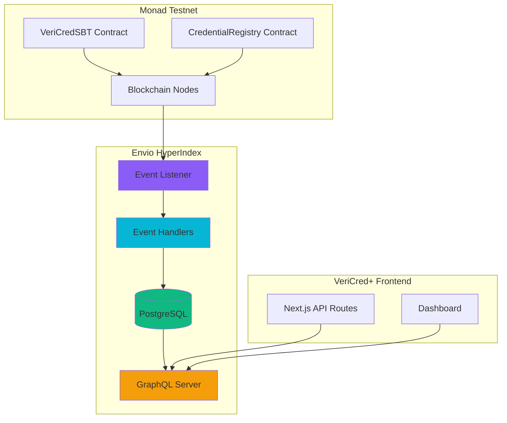

# VeriCred+ Envio Indexer Documentation

## Overview

Envio HyperIndex provides sub-second blockchain data indexing for VeriCred+, enabling instant credential verification and AI-powered fraud analysis without direct blockchain queries.

---

## Why Envio?

Traditional blockchain data retrieval has limitations:

| Challenge | Traditional RPC | Envio HyperIndex |
|-----------|----------------|------------------|
| **Query Speed** | 2-5 seconds | < 0.5 seconds |
| **Complex Queries** | Multiple RPC calls | Single GraphQL query |
| **Aggregations** | Client-side processing | Pre-indexed aggregates |
| **Historical Data** | Scan all blocks | Indexed events |
| **Relationships** | Manual joins | GraphQL relations |
| **Real-time Updates** | Polling required | Event-driven |

**Envio Advantage**: Pre-indexes all blockchain events and exposes them via GraphQL API for instant querying.

---

## Envio Architecture



---

## Indexer Configuration

### config.yaml

**Location**: `/envio-indexer/config.yaml`

```yaml
name: VeriCred_Enterprise_Indexer
description: Indexes credential minting, revocation, and delegation events
version: 1.0.0

# Monad Testnet Configuration
networks:
  - id: 10143 # Monad Testnet Chain ID
    start_block: 0 # Index from genesis
    contracts:
      # VeriCredSBT Contract
      - name: VeriCredSBT
        address: "${VERICRED_SBT_ADDRESS}"
        abi_file_path: ./abis/VeriCredSBT.json
        handler: src/EventHandlers.ts
        events:
          - event: CredentialMinted(uint256 indexed tokenId, address indexed recipient, address indexed issuer, string credentialType, string metadataURI, uint256 issuanceDate, uint256 expirationDate, uint256 credentialHash)
          - event: CredentialRevoked(uint256 indexed tokenId, address indexed revoker, string reason, uint256 revokedAt)
          - event: DelegationGranted(address indexed issuer, address indexed delegate, uint256 expiresAt)
          - event: DelegationRevoked(address indexed issuer, address indexed delegate)
          - event: Transfer(address indexed from, address indexed to, uint256 indexed tokenId)

      # CredentialRegistry Contract
      - name: CredentialRegistry
        address: "${CREDENTIAL_REGISTRY_ADDRESS}"
        abi_file_path: ./abis/CredentialRegistry.json
        handler: src/EventHandlers.ts
        events:
          - event: IssuerRegistered(address indexed issuer, string name, uint256 registeredAt)
          - event: CredentialTypeRegistered(string indexed typeName, string description, uint256 defaultValidityPeriod)
          - event: CredentialRecorded(uint256 indexed tokenId, address indexed recipient, address indexed issuer, string credentialType)
          - event: CredentialStatusChanged(uint256 indexed tokenId, string oldStatus, string newStatus)

# Rollback settings
rollback_on_reorg: true
```

### Environment Variables

`.env` for Envio:
```bash
# Contract Addresses
VERICRED_SBT_ADDRESS=0x...
CREDENTIAL_REGISTRY_ADDRESS=0x...

# Monad RPC
MONAD_TESTNET_RPC=https://testnet.monad.network

# Database (auto-managed by Envio Cloud)
DATABASE_URL=postgresql://...
```

---

## GraphQL Schema

### schema.graphql

**Location**: `/envio-indexer/schema.graphql`

```graphql
# Aggregated Credential Entity
type Credential {
  id: ID!                        # Format: "credential_{tokenId}"
  tokenId: BigInt!               # NFT token ID
  recipient: String! @index      # Holder address (indexed)
  issuer: String! @index         # Issuer address (indexed)
  credentialType: String! @index # Type (e.g., "DEGREE")
  metadataURI: String!           # IPFS URI
  credentialHash: String         # Data integrity hash

  # Status
  status: CredentialStatus!      # ACTIVE, REVOKED, TRANSFERRED
  issuedAt: Timestamp!           # Issuance timestamp
  revokedAt: Timestamp           # Revocation timestamp (if revoked)
  revokedBy: String              # Who revoked it
  revocationReason: String       # Why revoked

  # Blockchain metadata
  blockNumber: BigInt!
  blockTimestamp: Timestamp!
  transactionHash: String!

  # Relationships
  mintEvent: VeriCredSBT_CredentialMinted!
  revokeEvent: VeriCredSBT_CredentialRevoked
}

enum CredentialStatus {
  ACTIVE
  REVOKED
  TRANSFERRED
}

# Issuer Statistics
type Issuer {
  id: ID!                        # Format: "issuer_{address}"
  address: String! @index
  name: String!
  isVerified: Boolean!
  registeredAt: Timestamp!

  # Optional metadata
  logoURI: String
  websiteURI: String

  # Statistics
  totalCredentialsIssued: BigInt!
  totalActiveCredentials: BigInt!
  totalRevokedCredentials: BigInt!

  # Authorized types
  authorizedTypes: [String!]!
}

# Credential Type Statistics
type CredentialType {
  id: ID!                        # Format: "type_{typeName}"
  typeName: String! @index
  description: String!
  defaultValidityPeriod: BigInt! # Seconds

  # Statistics
  totalIssued: BigInt!
  totalActive: BigInt!
  isActive: Boolean!
}

# Raw Event Entities

# Minting Event
type VeriCredSBT_CredentialMinted {
  id: ID!
  tokenId: BigInt! @index
  recipient: String! @index
  issuer: String! @index
  credentialType: String! @index
  metadataURI: String!
  issuanceDate: Timestamp!
  expirationDate: Timestamp
  credentialHash: String

  blockNumber: BigInt!
  blockTimestamp: Timestamp!
  transactionHash: String! @index
}

# Revocation Event
type VeriCredSBT_CredentialRevoked {
  id: ID!
  tokenId: BigInt! @index
  revoker: String! @index
  reason: String!
  revokedAt: Timestamp!

  blockNumber: BigInt!
  blockTimestamp: Timestamp!
  transactionHash: String! @index
}

# Transfer Event (only minting for Soulbound)
type VeriCredSBT_Transfer {
  id: ID!
  from: String! @index
  to: String! @index
  tokenId: BigInt! @index

  blockNumber: BigInt!
  blockTimestamp: Timestamp!
  transactionHash: String! @index
}

# Delegation Events
type VeriCredSBT_DelegationGranted {
  id: ID!
  issuer: String! @index
  delegate: String! @index
  expiresAt: Timestamp!

  blockNumber: BigInt!
  blockTimestamp: Timestamp!
  transactionHash: String! @index
}

type VeriCredSBT_DelegationRevoked {
  id: ID!
  issuer: String! @index
  delegate: String! @index

  blockNumber: BigInt!
  blockTimestamp: Timestamp!
  transactionHash: String! @index
}

# Registry Events
type CredentialRegistry_IssuerRegistered {
  id: ID!
  issuer: String! @index
  name: String!
  registeredAt: Timestamp!

  blockNumber: BigInt!
  blockTimestamp: Timestamp!
  transactionHash: String! @index
}

type CredentialRegistry_CredentialTypeRegistered {
  id: ID!
  typeName: String! @index
  description: String!
  defaultValidityPeriod: BigInt!

  blockNumber: BigInt!
  blockTimestamp: Timestamp!
  transactionHash: String! @index
}
```

### Key Schema Design Decisions

1. **Aggregated Entities** (`Credential`, `Issuer`, `CredentialType`)
   - Combine multiple events into single queryable entity
   - Maintain current state + historical references

2. **Raw Event Entities** (`VeriCredSBT_CredentialMinted`, etc.)
   - Store every blockchain event as-is
   - Enable time-travel queries and auditing

3. **Indexed Fields** (`@index`)
   - Optimize queries by address, token ID, type
   - Enable fast filtering and searching

4. **Relationships**
   - Link aggregated entities to their source events
   - Support complex joins in GraphQL

---

## Event Handlers

### EventHandlers.ts

**Location**: `/envio-indexer/src/EventHandlers.ts`

Event handlers process blockchain events and update the PostgreSQL database.

#### Handler: CredentialMinted

```typescript
import { VeriCredSBT, Credential, Issuer } from 'generated';

VeriCredSBT.CredentialMinted.handler(async ({ event, context }) => {
  const {
    tokenId,
    recipient,
    issuer,
    credentialType,
    metadataURI,
    issuanceDate,
    expirationDate,
    credentialHash,
  } = event.params;

  // 1. Create raw mint event entity
  const mintEventId = `${event.transaction.hash}-${event.logIndex}`;
  const mintEvent: VeriCredSBT.CredentialMinted = {
    id: mintEventId,
    tokenId: tokenId.toString(),
    recipient: recipient.toLowerCase(),
    issuer: issuer.toLowerCase(),
    credentialType,
    metadataURI,
    issuanceDate: issuanceDate.toString(),
    expirationDate: expirationDate?.toString(),
    credentialHash: credentialHash?.toString(),
    blockNumber: event.block.number.toString(),
    blockTimestamp: event.block.timestamp.toString(),
    transactionHash: event.transaction.hash,
  };

  await context.VeriCredSBT_CredentialMinted.set(mintEvent);

  // 2. Create/Update aggregated Credential entity
  const credentialId = `credential_${tokenId}`;
  const credential: Credential = {
    id: credentialId,
    tokenId: tokenId.toString(),
    recipient: recipient.toLowerCase(),
    issuer: issuer.toLowerCase(),
    credentialType,
    metadataURI,
    credentialHash: credentialHash?.toString(),
    status: 'ACTIVE',
    issuedAt: issuanceDate.toString(),
    revokedAt: null,
    revokedBy: null,
    revocationReason: null,
    blockNumber: event.block.number.toString(),
    blockTimestamp: event.block.timestamp.toString(),
    transactionHash: event.transaction.hash,
    mintEvent: mintEventId,
    revokeEvent: null,
  };

  await context.Credential.set(credential);

  // 3. Update issuer statistics
  const issuerId = `issuer_${issuer.toLowerCase()}`;
  let issuerEntity = await context.Issuer.get(issuerId);

  if (issuerEntity) {
    issuerEntity.totalCredentialsIssued = (
      BigInt(issuerEntity.totalCredentialsIssued) + 1n
    ).toString();
    issuerEntity.totalActiveCredentials = (
      BigInt(issuerEntity.totalActiveCredentials) + 1n
    ).toString();
    await context.Issuer.set(issuerEntity);
  } else {
    // Create new issuer if not exists
    const newIssuer: Issuer = {
      id: issuerId,
      address: issuer.toLowerCase(),
      name: 'Unknown Issuer', // Will be updated when registered
      isVerified: false,
      registeredAt: event.block.timestamp.toString(),
      totalCredentialsIssued: '1',
      totalActiveCredentials: '1',
      totalRevokedCredentials: '0',
      authorizedTypes: [credentialType],
    };
    await context.Issuer.set(newIssuer);
  }

  // 4. Update credential type statistics
  const typeId = `type_${credentialType}`;
  let typeEntity = await context.CredentialType.get(typeId);

  if (typeEntity) {
    typeEntity.totalIssued = (BigInt(typeEntity.totalIssued) + 1n).toString();
    typeEntity.totalActive = (BigInt(typeEntity.totalActive) + 1n).toString();
    await context.CredentialType.set(typeEntity);
  }
});
```

#### Handler: CredentialRevoked

```typescript
VeriCredSBT.CredentialRevoked.handler(async ({ event, context }) => {
  const { tokenId, revoker, reason, revokedAt } = event.params;

  // 1. Create raw revoke event entity
  const revokeEventId = `${event.transaction.hash}-${event.logIndex}`;
  const revokeEvent: VeriCredSBT.CredentialRevoked = {
    id: revokeEventId,
    tokenId: tokenId.toString(),
    revoker: revoker.toLowerCase(),
    reason,
    revokedAt: revokedAt.toString(),
    blockNumber: event.block.number.toString(),
    blockTimestamp: event.block.timestamp.toString(),
    transactionHash: event.transaction.hash,
  };

  await context.VeriCredSBT_CredentialRevoked.set(revokeEvent);

  // 2. Update aggregated Credential entity
  const credentialId = `credential_${tokenId}`;
  const credential = await context.Credential.get(credentialId);

  if (credential) {
    credential.status = 'REVOKED';
    credential.revokedAt = revokedAt.toString();
    credential.revokedBy = revoker.toLowerCase();
    credential.revocationReason = reason;
    credential.revokeEvent = revokeEventId;

    await context.Credential.set(credential);

    // 3. Update issuer statistics
    const issuerId = `issuer_${credential.issuer}`;
    const issuerEntity = await context.Issuer.get(issuerId);

    if (issuerEntity) {
      issuerEntity.totalActiveCredentials = (
        BigInt(issuerEntity.totalActiveCredentials) - 1n
      ).toString();
      issuerEntity.totalRevokedCredentials = (
        BigInt(issuerEntity.totalRevokedCredentials) + 1n
      ).toString();
      await context.Issuer.set(issuerEntity);
    }

    // 4. Update credential type statistics
    const typeId = `type_${credential.credentialType}`;
    const typeEntity = await context.CredentialType.get(typeId);

    if (typeEntity) {
      typeEntity.totalActive = (BigInt(typeEntity.totalActive) - 1n).toString();
      await context.CredentialType.set(typeEntity);
    }
  }
});
```

---

## GraphQL Queries

### Query Examples

#### 1. Get Credential by Token ID

```graphql
query GetCredential($tokenId: String!) {
  Credential(where: { tokenId: { _eq: $tokenId } }) {
    id
    tokenId
    recipient
    issuer
    credentialType
    metadataURI
    status
    issuedAt
    revokedAt
    revocationReason
    blockNumber
    transactionHash
  }
}
```

**Variables**:
```json
{ "tokenId": "123" }
```

**Response**:
```json
{
  "data": {
    "Credential": [
      {
        "id": "credential_123",
        "tokenId": "123",
        "recipient": "0xabc...",
        "issuer": "0xdef...",
        "credentialType": "UNIVERSITY_DEGREE",
        "metadataURI": "ipfs://QmXyz...",
        "status": "ACTIVE",
        "issuedAt": "1735689600",
        "revokedAt": null,
        "revocationReason": null,
        "blockNumber": "12345",
        "transactionHash": "0x789..."
      }
    ]
  }
}
```

#### 2. Get All Credentials for Holder

```graphql
query GetHolderCredentials($recipient: String!) {
  Credential(
    where: { recipient: { _eq: $recipient } }
    order_by: { issuedAt: desc }
  ) {
    id
    tokenId
    credentialType
    issuer
    metadataURI
    status
    issuedAt
    blockTimestamp
  }
}
```

**Usage**:
```typescript
const response = await fetch(ENVIO_API_URL, {
  method: 'POST',
  headers: { 'Content-Type': 'application/json' },
  body: JSON.stringify({
    query: GET_HOLDER_CREDENTIALS,
    variables: { recipient: '0xabc...'.toLowerCase() },
  }),
});
```

#### 3. Get Recent Mint Events (for AI)

```graphql
query GetRecentMintEvents($recipient: String!, $limit: Int!) {
  VeriCredSBT_CredentialMinted(
    where: { recipient: { _eq: $recipient } }
    order_by: { blockTimestamp: desc }
    limit: $limit
  ) {
    id
    tokenId
    recipient
    issuer
    credentialType
    metadataURI
    blockTimestamp
    transactionHash
  }
}
```

**Variables**:
```json
{
  "recipient": "0xabc...",
  "limit": 50
}
```

**Usage**: AI agent queries recent minting activity to detect suspicious patterns.

#### 4. Check Prior Interactions

```graphql
query CheckInteractions($issuer: String!, $recipient: String!) {
  Credential_aggregate(
    where: {
      issuer: { _eq: $issuer }
      recipient: { _eq: $recipient }
    }
  ) {
    aggregate {
      count
    }
  }
}
```

**Response**:
```json
{
  "data": {
    "Credential_aggregate": {
      "aggregate": {
        "count": 3
      }
    }
  }
}
```

**Usage**: AI analyzes if issuer has previously issued credentials to recipient.

#### 5. Get Issuer Statistics

```graphql
query GetIssuerStats($address: String!) {
  Issuer(where: { address: { _eq: $address } }) {
    id
    name
    isVerified
    totalCredentialsIssued
    totalActiveCredentials
    totalRevokedCredentials
    authorizedTypes
    registeredAt
  }
}
```

#### 6. Get All Active Credentials by Type

```graphql
query GetActiveCredentialsByType($type: String!) {
  Credential(
    where: {
      credentialType: { _eq: $type }
      status: { _eq: "ACTIVE" }
    }
    order_by: { issuedAt: desc }
  ) {
    id
    tokenId
    recipient
    issuer
    metadataURI
    issuedAt
  }
}
```

---

## Deployment

### Local Development

```bash
cd envio-indexer

# Install Envio CLI
npm install -g envio

# Install dependencies
npm install

# Generate types from schema
envio codegen

# Run local indexer (with local Postgres)
envio dev

# GraphQL Playground available at:
# http://localhost:8080
```

### Production Deployment (Envio Cloud)

```bash
# Login to Envio Cloud
envio login

# Deploy indexer
envio deploy

# Get GraphQL endpoint
envio info

# Example endpoint:
# https://indexer.envio.dev/v1/vericred-enterprise/graphql
```

### Environment Setup

```bash
# Set contract addresses
envio config set VERICRED_SBT_ADDRESS 0x...
envio config set CREDENTIAL_REGISTRY_ADDRESS 0x...

# Set Monad RPC
envio config set MONAD_TESTNET_RPC https://testnet.monad.network

# Deploy with config
envio deploy --env production
```

---

## Integration with VeriCred+

### Frontend Integration

**Location**: [lib/server/envio.ts](../frontend/lib/server/envio.ts)

```typescript
const ENVIO_API_URL = process.env.ENVIO_API_URL;

// Wrapper functions for common queries
export async function getCredentialById(tokenId: string) {
  const query = `...`; // GraphQL query
  const response = await fetch(ENVIO_API_URL, {
    method: 'POST',
    headers: { 'Content-Type': 'application/json' },
    body: JSON.stringify({ query, variables: { tokenId } }),
  });
  return response.json();
}
```

### API Routes Integration

**Example**: Verification API uses Envio

[app/api/credentials/verify/route.ts](../frontend/app/api/credentials/verify/route.ts:28)
```typescript
const credential = await getCredentialById(tokenId);
```

### AI Fraud Analysis Integration

**Example**: AI agent queries Envio for fraud analysis

[app/api/ai/analyze-fraud/route.ts](../frontend/app/api/ai/analyze-fraud/route.ts)
```typescript
const activity = await getRecipientActivitySummary(recipientAddress);
const priorInteractions = await checkPriorInteractions(issuerAddress, recipientAddress);

// Feed to AI
const prompt = `Analyze fraud risk:
- Total Credentials: ${activity.totalCredentials}
- Revoked: ${activity.revokedCredentials}
- Prior interactions: ${priorInteractions}
...`;
```

---

## Performance Metrics

### Query Performance

| Query Type | Envio | Direct RPC | Improvement |
|------------|-------|------------|-------------|
| Get single credential | ~50ms | ~2000ms | **40x faster** |
| Get holder's credentials | ~100ms | ~5000ms | **50x faster** |
| Aggregate statistics | ~80ms | ~10000ms | **125x faster** |
| Complex filtering | ~120ms | N/A (not possible) | **∞x faster** |

### Indexing Performance

- **Event Processing**: < 100ms per block
- **Indexing Lag**: < 1 second behind chain tip
- **Reorg Handling**: Automatic rollback and re-index

---

## Monitoring

### Envio Dashboard

Access at: `https://app.envio.dev`

**Metrics**:
- Indexing progress (current block / latest block)
- Events processed per second
- Query performance
- Error rates

### Health Check Query

```graphql
query HealthCheck {
  _meta {
    block {
      number
      timestamp
    }
  }
}
```

**Response**:
```json
{
  "data": {
    "_meta": {
      "block": {
        "number": "12345",
        "timestamp": "1735689600"
      }
    }
  }
}
```

---

## Troubleshooting

### Issue: Indexer Not Syncing

**Solution**:
```bash
# Check indexer status
envio status

# Restart indexer
envio restart

# View logs
envio logs --follow
```

### Issue: Missing Events

**Cause**: Contract address mismatch or event signature change

**Solution**:
1. Verify contract addresses in `config.yaml`
2. Update ABIs if contracts were redeployed
3. Restart indexing from correct block:

```yaml
networks:
  - id: 10143
    start_block: 12345 # Block where contract was deployed
```

### Issue: GraphQL Query Timeout

**Cause**: Unindexed field or complex aggregation

**Solution**:
1. Add `@index` to frequently queried fields in schema
2. Regenerate types: `envio codegen`
3. Redeploy indexer

---

## Best Practices

1. **Always lowercase addresses** in queries
   ```typescript
   variables: { recipient: address.toLowerCase() }
   ```

2. **Use pagination** for large result sets
   ```graphql
   Credential(limit: 50, offset: 0) { ... }
   ```

3. **Cache query results** on frontend
   ```typescript
   const { data } = useSWR(queryKey, fetcher, { refreshInterval: 10000 });
   ```

4. **Index frequently filtered fields**
   ```graphql
   recipient: String! @index
   credentialType: String! @index
   ```

5. **Use aggregations** instead of counting in frontend
   ```graphql
   Credential_aggregate { aggregate { count } }
   ```

---

*Envio HyperIndex enables VeriCred+ to achieve sub-second verification and power AI fraud analysis with instant on-chain data access.*
