# VeriCred+ AI & Delegation Flow Documentation

## Overview

VeriCred+ combines AI-powered fraud detection with MetaMask Smart Account delegation to enable automated, secure credential issuance. This document explains how these systems work together.

---

## The Problem

Traditional credential issuance faces challenges:

1. **Manual Verification**: Issuers must manually check if recipient is legitimate
2. **Fraud Risk**: No automated way to detect suspicious patterns
3. **Gas Costs**: Users must pay gas for every transaction
4. **UX Friction**: Multiple wallet signatures required

**VeriCred+ Solution**: AI analyzes on-chain history → User grants time-bounded delegation → Backend mints credentials automatically

---

## High-Level Flow

```mermaid
sequenceDiagram
    participant Issuer
    participant Frontend
    participant AI_API
    participant Envio
    participant Backend
    participant SmartAccount
    participant VeriCredSBT
    participant Blockchain

    Note over Issuer,Blockchain: Phase 1: Onboarding & Delegation Setup

    Issuer->>Frontend: Connect Wallet (MetaMask)
    Frontend->>Issuer: Request Smart Account
    Issuer->>Frontend: Sign Smart Account Creation
    Frontend->>SmartAccount: Deploy Smart Account
    SmartAccount-->>Frontend: Smart Account Address

    Frontend->>Issuer: Request Delegation Permission
    Note over Issuer: Modal: "Grant backend permission<br/>to issue credentials on your behalf"
    Issuer->>Frontend: Approve Delegation
    Frontend->>Issuer: MetaMask: Sign Delegation (EIP-712)
    Issuer->>Frontend: Signed Delegation
    Frontend->>Backend: Register Delegation
    Backend-->>Frontend: ✅ Delegation Active

    Note over Issuer,Blockchain: Phase 2: AI-Powered Credential Issuance

    Issuer->>Frontend: Enter Recipient Address
    Frontend->>AI_API: Analyze Fraud Risk
    AI_API->>Envio: Query Recipient History
    Envio-->>AI_API: On-chain Activity Data
    AI_API->>AI_API: GPT-4o Fraud Analysis
    AI_API-->>Frontend: Risk Score + Recommendation

    alt Risk Score > 70 (High Risk)
        Frontend-->>Issuer: ⚠️ High Risk - Review Required
        Issuer->>Frontend: Override or Cancel
    else Risk Score ≤ 70 (Low/Medium Risk)
        Frontend-->>Issuer: ✅ Safe to Issue
    end

    Issuer->>Frontend: Confirm Issuance
    Frontend->>Backend: POST /api/credentials/issue
    Backend->>Backend: Verify Delegation Valid
    Backend->>VeriCredSBT: mintCredential() via Delegation
    VeriCredSBT->>Blockchain: Mint SBT
    Blockchain-->>Envio: CredentialMinted Event
    Envio-->>Frontend: Real-time Update
    Frontend-->>Issuer: ✅ Credential Issued
```



---

## Part 1: MetaMask Smart Accounts & Delegation

### What is a Smart Account?

A **Smart Account** is an ERC-4337 account abstraction that enables:
- **Gasless Transactions**: Smart account pays gas, not user's EOA
- **Delegation**: Grant time-bounded permissions to other addresses
- **Programmable Logic**: Custom rules and restrictions


### Smart Account Creation Flow

**Location**: [lib/delegation/smart-account.ts](../frontend/lib/delegation/smart-account.ts)

```typescript
import {
  createMetaMaskAccount,
  MetaMaskSmartAccountV1,
} from '@metamask/delegation-toolkit';

async function createSmartAccount(
  userAddress: Address,
  walletClient: WalletClient
) {
  // 1. Generate deterministic salt from user address
  const salt = keccak256(encodePacked(['address'], [userAddress]));

  // 2. Create smart account (deploys if needed)
  const smartAccount = await createMetaMaskAccount({
    implementation: MetaMaskSmartAccountV1, // Use MetaMask's implementation
    deployParams: [userAddress], // Owner = user's EOA
    deploySalt: salt, // Deterministic address
    signatory: {
      account: userAddress,
      type: 'eoa',
    },
  });

  console.log('Smart Account Address:', smartAccount.address);
  console.log('Owner:', userAddress);

  return smartAccount;
}
```

**Key Points**:
- Smart account address is **deterministic** (same EOA = same smart account)
- No deployment transaction needed upfront (lazy deployment)
- User retains **full control** via EOA ownership

---

### Delegation Setup Flow

**Location**: [lib/delegation/delegation.service.ts](../frontend/lib/delegation/delegation.service.ts)

#### Step 1: Build Delegation with Caveats

```typescript
import {
  createDelegation,
  CaveatBuilder,
  signDelegation,
} from '@metamask/delegation-toolkit';

async function setupDelegation(params: {
  issuerAddress: Address;
  backendAddress: Address;
  veriCredSBTAddress: Address;
  walletClient: WalletClient;
}) {
  // Create smart account
  const smartAccount = await createSmartAccount(
    params.issuerAddress,
    params.walletClient
  );

  // Build caveats (restrictions)
  const caveatBuilder = new CaveatBuilder(smartAccount.environment);

  // Caveat 1: Only allow VeriCredSBT contract
  caveatBuilder.addCaveat('allowedTargets', {
    targets: [params.veriCredSBTAddress],
  });

  // Caveat 2: Only allow mintCredential function
  const mintCredentialSelector = '0x83115c5b'; // keccak256('mintCredential(...)')
  caveatBuilder.addCaveat('allowedMethods', {
    selectors: [mintCredentialSelector],
  });

  // Caveat 3: Limit to 100 credentials
  caveatBuilder.addCaveat('limitedCalls', {
    limit: 100,
    period: 0, // No reset period
  });

  // Caveat 4: Time-bounded (30 days)
  const now = Math.floor(Date.now() / 1000);
  const expiryTimestamp = now + 30 * 24 * 60 * 60; // 30 days

  caveatBuilder.addCaveat('timestamp', {
    afterThreshold: now,
    beforeThreshold: expiryTimestamp,
  });

  // Build delegation object
  const delegation = createDelegation({
    from: smartAccount.address, // Smart account delegates
    to: params.backendAddress, // Backend receives permission
    environment: smartAccount.environment,
    scope: {
      type: 'functionCall',
      targets: [params.veriCredSBTAddress],
      selectors: [mintCredentialSelector],
    },
    caveats: caveatBuilder.build(),
  });

  return { smartAccount, delegation };
}
```

#### Step 2: Sign Delegation (EIP-712)

```typescript
async function signDelegationRequest(
  delegation: Delegation,
  walletClient: WalletClient
) {
  // User signs delegation via MetaMask
  // This is an EIP-712 typed data signature
  const signedDelegation = await signDelegation(delegation, walletClient);

  console.log('Signed Delegation:', signedDelegation);
  return signedDelegation;
}
```

**MetaMask Popup**:
```
Sign Delegation Request

You are granting permission to:
Address: 0xBACKEND_ADDRESS

To perform:
- Call mintCredential on VeriCredSBT contract

Restrictions:
- Maximum 100 calls
- Expires: Jan 1, 2025
- Only specific contract and function

[Cancel] [Sign]
```

#### Step 3: Store Delegation

```typescript
// Frontend stores delegation in localStorage
localStorage.setItem(
  'delegation',
  JSON.stringify({
    delegation: signedDelegation,
    smartAccountAddress: smartAccount.address,
    expiresAt: expiryTimestamp,
  })
);

// Backend registers delegation
await fetch('/api/delegation/register', {
  method: 'POST',
  headers: { 'Content-Type': 'application/json' },
  body: JSON.stringify({
    issuerAddress: params.issuerAddress,
    smartAccountAddress: smartAccount.address,
    delegation: signedDelegation,
  }),
});
```

---

### Delegation Caveats Explained


| Caveat | Purpose | Example |
|--------|---------|---------|
| **allowedTargets** | Restrict to specific contracts | `[VeriCredSBT_ADDRESS]` |
| **allowedMethods** | Restrict to specific functions | `['0x83115c5b']` (mintCredential) |
| **limitedCalls** | Prevent abuse with call limit | `{ limit: 100, period: 0 }` |
| **timestamp** | Time-bounded access | `{ afterThreshold: now, beforeThreshold: now + 30 days }` |

**Security Benefits**:
- Backend **cannot** call any other function
- Backend **cannot** interact with other contracts
- Backend **cannot** mint more than 100 credentials
- Backend **cannot** use delegation after 30 days

---

## Part 2: AI Fraud Detection

### AI Analysis Architecture


---

### AI Fraud Analysis Flow

**Location**: [app/api/ai/analyze-fraud/route.ts](../frontend/app/api/ai/analyze-fraud/route.ts)

#### Step 1: Collect On-Chain Data

```typescript
import { getRecipientActivitySummary, checkPriorInteractions } from '@/lib/server/envio';

export async function POST(request: NextRequest) {
  const { recipientAddress, issuerAddress, credentialType } = await request.json();

  // Query Envio for recipient's on-chain history
  const activity = await getRecipientActivitySummary(recipientAddress);

  // Check if issuer has issued to this recipient before
  const priorInteractions = await checkPriorInteractions(
    issuerAddress,
    recipientAddress
  );

  console.log('Recipient Activity:', activity);
  /*
  {
    address: '0x123...',
    totalCredentials: 15,
    activeCredentials: 12,
    revokedCredentials: 3,
    recentActivity: [...], // Last 10 mints
    credentialTypes: ['DEGREE', 'LICENSE'],
    issuers: ['0xabc...', '0xdef...']
  }
  */

  console.log('Prior Interactions:', priorInteractions); // 2
}
```

**Envio Queries Used**:

```typescript
// Get all credentials for recipient
export async function getRecipientActivitySummary(address: string) {
  const [credentials, recentMints] = await Promise.all([
    getCredentialsByRecipient(address), // All credentials
    getRecentMintEvents(address, 20),   // Last 20 mints
  ]);

  return {
    address,
    totalCredentials: credentials.length,
    activeCredentials: credentials.filter(c => c.status === 'ACTIVE').length,
    revokedCredentials: credentials.filter(c => c.status === 'REVOKED').length,
    recentActivity: recentMints.slice(0, 10),
    credentialTypes: [...new Set(credentials.map(c => c.credentialType))],
    issuers: [...new Set(credentials.map(c => c.issuer))],
  };
}

// Check prior issuer-recipient interactions
export async function checkPriorInteractions(
  issuerAddress: string,
  recipientAddress: string
) {
  const query = `
    query CheckInteractions($issuer: String!, $recipient: String!) {
      Credential_aggregate(
        where: {
          issuer: { _eq: $issuer }
          recipient: { _eq: $recipient }
        }
      ) {
        aggregate { count }
      }
    }
  `;

  const response = await fetch(ENVIO_API_URL, {
    method: 'POST',
    headers: { 'Content-Type': 'application/json' },
    body: JSON.stringify({
      query,
      variables: {
        issuer: issuerAddress.toLowerCase(),
        recipient: recipientAddress.toLowerCase(),
      },
    }),
  });

  const data = await response.json();
  return data.data?.Credential_aggregate?.aggregate?.count || 0;
}
```

---

#### Step 2: Build AI Prompt

```typescript
const prompt = `Analyze fraud risk for credential issuance.

**Context:**
- **Recipient Address**: ${recipientAddress}
- **Issuer Address**: ${issuerAddress}
- **Credential Type**: ${credentialType}

**Recipient's On-Chain Activity:**
- **Total Credentials Held**: ${activity.totalCredentials}
- **Active Credentials**: ${activity.activeCredentials}
- **Revoked Credentials**: ${activity.revokedCredentials}
- **Prior Interactions with Issuer**: ${priorInteractions}
- **Credential Types Held**: ${activity.credentialTypes.join(', ')}
- **Unique Issuers**: ${activity.issuers.length}

**Recent Activity (Last 10 Mints):**
${JSON.stringify(activity.recentActivity, null, 2)}

**Task:**
Analyze the above data and assess the fraud risk of issuing a credential to this recipient.

**Consider:**
1. **Revocation Rate**: High revoked/total ratio indicates fraud history
2. **Velocity**: Too many credentials in short time = suspicious
3. **Issuer Relationship**: No prior interaction = higher risk
4. **Credential Diversity**: Only one type from one issuer = potential fraud ring
5. **Abnormal Patterns**: Minting patterns that don't match normal behavior

**Output (JSON format):**
{
  "riskScore": 0-100,  // 0 = no risk, 100 = maximum risk
  "riskLevel": "Low" | "Medium" | "High",
  "analysis": "Detailed explanation of risk factors",
  "recommendation": "Approve" | "Reject" | "Review",
  "redFlags": ["flag1", "flag2", ...],
  "confidence": 0-100  // AI confidence in assessment
}`;
```

---

#### Step 3: Call OpenAI GPT-4o

```typescript
import OpenAI from 'openai';

const openai = new OpenAI({
  apiKey: process.env.OPENAI_API_KEY,
});

const completion = await openai.chat.completions.create({
  model: 'gpt-4o', // Latest GPT-4 Optimized model
  messages: [
    {
      role: 'system',
      content:
        'You are an expert fraud detection analyst specializing in blockchain credential verification. Analyze on-chain data to assess fraud risk.',
    },
    {
      role: 'user',
      content: prompt,
    },
  ],
  response_format: { type: 'json_object' }, // Force JSON output
  temperature: 0.3, // Lower temperature for consistent analysis
});

const analysis = JSON.parse(completion.choices[0].message.content);
```

**Example AI Response**:

```json
{
  "riskScore": 25,
  "riskLevel": "Low",
  "analysis": "Recipient has a clean history with 15 total credentials, only 3 revoked (20% revocation rate, within normal range). The recipient has interacted with 5 different issuers across diverse credential types (DEGREE, LICENSE), indicating legitimate usage. Prior interaction with this issuer (2 previous credentials) reduces risk. Recent activity shows steady minting pace over 6 months, not suspicious velocity.",
  "recommendation": "Approve",
  "redFlags": [],
  "confidence": 85
}
```

**Example High-Risk Response**:

```json
{
  "riskScore": 85,
  "riskLevel": "High",
  "analysis": "CRITICAL: Recipient received 50 credentials in last 24 hours from 10 different issuers, all of type 'DEGREE'. Revocation rate is 60% (30/50). No prior interaction with current issuer. Pattern matches known credential farming behavior.",
  "recommendation": "Reject",
  "redFlags": [
    "Abnormal minting velocity (50 in 24h)",
    "High revocation rate (60%)",
    "No prior issuer relationship",
    "Suspicious single-type concentration"
  ],
  "confidence": 95
}
```

---

#### Step 4: Return Risk Analysis to Frontend

```typescript
return NextResponse.json({
  riskScore: analysis.riskScore,
  riskLevel: analysis.riskLevel,
  analysis: analysis.analysis,
  recommendation: analysis.recommendation,
  redFlags: analysis.redFlags || [],
  confidence: analysis.confidence,
});
```

---

### Frontend Risk Display

**Location**: [app/issuer/issue/page.tsx](../frontend/app/issuer/issue/page.tsx)

```tsx
{riskAnalysis && (
  <div className="mt-6 p-6 bg-slate-900/50 border border-white/10 rounded-xl">
    <h3 className="text-lg font-bold mb-4">🤖 AI Risk Analysis</h3>

    {/* Risk Score Badge */}
    <div className="flex items-center gap-4 mb-4">
      <div
        className={`px-4 py-2 rounded-lg font-bold ${
          riskAnalysis.riskLevel === 'Low'
            ? 'bg-green-500/20 text-green-400'
            : riskAnalysis.riskLevel === 'Medium'
            ? 'bg-yellow-500/20 text-yellow-400'
            : 'bg-red-500/20 text-red-400'
        }`}
      >
        {riskAnalysis.riskLevel === 'Low' && '🟢'}
        {riskAnalysis.riskLevel === 'Medium' && '🟡'}
        {riskAnalysis.riskLevel === 'High' && '🔴'}
        {' '}
        {riskAnalysis.riskLevel} Risk ({riskAnalysis.riskScore}/100)
      </div>

      <div className="text-sm text-slate-400">
        Confidence: {riskAnalysis.confidence}%
      </div>
    </div>

    {/* Analysis Text */}
    <p className="text-sm text-slate-300 mb-4">{riskAnalysis.analysis}</p>

    {/* Red Flags */}
    {riskAnalysis.redFlags?.length > 0 && (
      <div className="mb-4">
        <p className="text-sm font-bold text-red-400 mb-2">⚠️ Red Flags:</p>
        <ul className="list-disc list-inside text-sm text-slate-400">
          {riskAnalysis.redFlags.map((flag, i) => (
            <li key={i}>{flag}</li>
          ))}
        </ul>
      </div>
    )}

    {/* Recommendation */}
    <div
      className={`px-4 py-3 rounded-lg font-bold ${
        riskAnalysis.recommendation === 'Approve'
          ? 'bg-green-500/10 text-green-400'
          : riskAnalysis.recommendation === 'Reject'
          ? 'bg-red-500/10 text-red-400'
          : 'bg-yellow-500/10 text-yellow-400'
      }`}
    >
      Recommendation: {riskAnalysis.recommendation}
    </div>
  </div>
)}
```

**Visual Examples**:

**Low Risk** (Score: 25):
```
🟢 Low Risk (25/100)   Confidence: 85%

Recipient has a clean history with 15 total credentials, only 3 revoked
(20% revocation rate, within normal range)...

Recommendation: Approve ✅
```

**High Risk** (Score: 85):
```
🔴 High Risk (85/100)   Confidence: 95%

CRITICAL: Recipient received 50 credentials in last 24 hours...

⚠️ Red Flags:
• Abnormal minting velocity (50 in 24h)
• High revocation rate (60%)
• No prior issuer relationship

Recommendation: Reject ❌
```

---

## Part 3: Delegated Credential Issuance

### Backend Executes via Delegation

**Location**: [app/api/credentials/issue/route.ts](../frontend/app/api/credentials/issue/route.ts)

```typescript
import { createWalletClient, http } from 'viem';
import { monadTestnet } from '@/lib/delegation/chains';
import VeriCredSBTABI from '@/lib/contracts/abis/VeriCredSBT.json';

export async function POST(request: NextRequest) {
  const {
    recipientAddress,
    credentialType,
    metadataURI,
    expirationDate,
    credentialHash,
    issuerAddress,
    delegation, // Signed delegation from frontend
  } = await request.json();

  // 1. Verify delegation is valid
  if (!verifyDelegation(delegation, issuerAddress)) {
    return NextResponse.json({ error: 'Invalid delegation' }, { status: 403 });
  }

  // 2. Create wallet client for backend
  const backendWalletClient = createWalletClient({
    chain: monadTestnet,
    transport: http(),
    account: process.env.BACKEND_PRIVATE_KEY, // Backend's private key
  });

  // 3. Call VeriCredSBT.mintCredential() via delegation
  try {
    const { hash } = await backendWalletClient.writeContract({
      address: process.env.NEXT_PUBLIC_VERICRED_SBT_ADDRESS,
      abi: VeriCredSBTABI,
      functionName: 'mintCredential',
      args: [
        recipientAddress,
        credentialType,
        metadataURI,
        expirationDate || 0,
        credentialHash || '0x0',
      ],
      // Delegation proof attached here (MetaMask Delegation Toolkit handles this)
    });

    console.log('Credential minted:', hash);

    // 4. Wait for transaction confirmation
    const receipt = await backendWalletClient.waitForTransactionReceipt({
      hash,
    });

    // 5. Extract token ID from event logs
    const mintEvent = receipt.logs.find(
      (log) => log.topics[0] === keccak256(toUtf8Bytes('CredentialMinted(...)'))
    );

    const tokenId = mintEvent ? BigInt(mintEvent.topics[1]).toString() : null;

    return NextResponse.json({
      success: true,
      transactionHash: hash,
      tokenId,
      blockNumber: receipt.blockNumber.toString(),
    });
  } catch (error) {
    console.error('Failed to mint credential:', error);
    return NextResponse.json(
      { error: 'Failed to mint credential' },
      { status: 500 }
    );
  }
}
```

---

### Full Issuance Flow

```mermaid
sequenceDiagram
    participant Issuer
    participant Frontend
    participant AI_API
    participant Backend
    participant SmartAccount
    participant VeriCredSBT

    Issuer->>Frontend: Enter recipient address
    Frontend->>AI_API: POST /api/ai/analyze-fraud
    AI_API-->>Frontend: { riskScore: 25, recommendation: "Approve" }
    Frontend-->>Issuer: Display risk analysis

    Issuer->>Frontend: Confirm issuance
    Frontend->>Frontend: Retrieve delegation from localStorage
    Frontend->>Backend: POST /api/credentials/issue<br/>{recipient, type, delegation}

    Backend->>Backend: Verify delegation valid
    Backend->>VeriCredSBT: mintCredential(recipient, type, ...)
    Note over Backend,VeriCredSBT: Backend uses delegation to call<br/>on behalf of issuer's smart account

    VeriCredSBT->>VeriCredSBT: Check risk assessment (optional)
    VeriCredSBT->>VeriCredSBT: Mint SBT to recipient
    VeriCredSBT-->>Backend: Transaction hash

    Backend-->>Frontend: { success: true, txHash, tokenId }
    Frontend-->>Issuer: ✅ Credential issued!<br/>Token ID: 123
```



---

## Security Considerations

### Delegation Security


### AI Analysis Security

| Risk | Mitigation |
|------|-----------|
| **Biased AI decisions** | Human override always available |
| **Adversarial inputs** | Multiple data sources (Envio + on-chain) |
| **AI hallucinations** | Confidence score displayed |
| **Privacy concerns** | Only on-chain public data analyzed |
| **Costs** | Cache results for 24h per address |

---

## Performance Optimizations

### Caching Strategy

```typescript
// Cache AI risk assessments
const riskCache = new Map<string, { result: any; timestamp: number }>();
const CACHE_DURATION = 24 * 60 * 60 * 1000; // 24 hours

export async function analyzeFraudRisk(recipientAddress: string) {
  // Check cache first
  const cached = riskCache.get(recipientAddress);
  if (cached && Date.now() - cached.timestamp < CACHE_DURATION) {
    return cached.result;
  }

  // Query Envio and call AI
  const result = await performAIAnalysis(recipientAddress);

  // Cache result
  riskCache.set(recipientAddress, {
    result,
    timestamp: Date.now(),
  });

  return result;
}
```

### Parallel Queries

```typescript
// Query Envio in parallel
const [activity, priorInteractions, issuerInfo] = await Promise.all([
  getRecipientActivitySummary(recipientAddress),
  checkPriorInteractions(issuerAddress, recipientAddress),
  getIssuerInfo(issuerAddress),
]);
```

---

## Monitoring & Analytics

### Delegation Metrics

Track delegation usage:
- Total delegations created
- Active delegations count
- Credentials minted via delegation
- Delegation expiration rate
- Revocation rate

### AI Metrics

Track AI performance:
- Average risk score distribution
- False positive rate (approved but later revoked)
- False negative rate (rejected but should have been approved)
- AI confidence correlation with outcomes
- Processing time per analysis

---

*VeriCred+ combines AI fraud detection with MetaMask Smart Account delegation for secure, automated, and intelligent credential issuance.*
