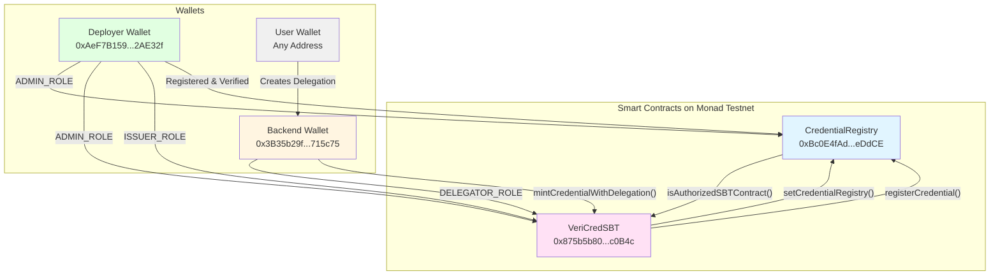
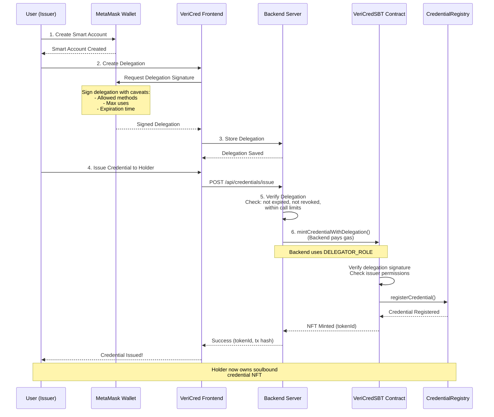
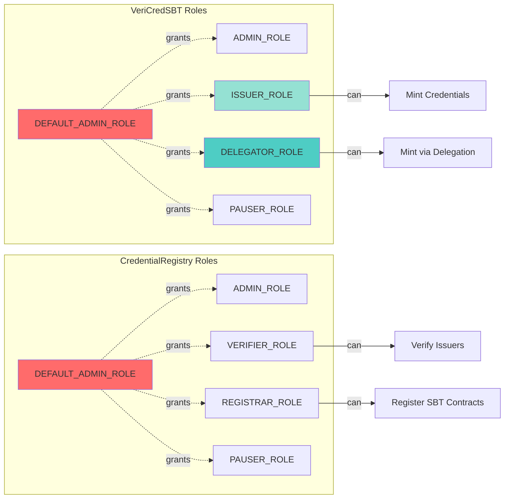

# Smart Contract Deployment Guide

**Date:** October 18, 2024  
**Network:** Monad Testnet (Chain ID: 10143)  
**Status:** ✅ Complete

---

## Table of Contents

1. [Overview](#overview)
2. [Pre-Deployment Setup](#pre-deployment-setup)
3. [Deployment Process](#deployment-process)
4. [Post-Deployment Configuration](#post-deployment-configuration)
5. [Verification](#verification)
6. [Architecture Diagram](#architecture-diagram)

---

## Overview

This guide documents the complete deployment of VeriCred's smart contract system to Monad Testnet, including:

- **CredentialRegistry**: Central registry for all credential metadata and issuer management
- **VeriCredSBT**: Soulbound token (non-transferable NFT) for credentials

### Deployed Contract Addresses

```
CredentialRegistry: 0xBc0E4fAdcfD447D084C2EC66D5265d7F714eDdCE
VeriCredSBT:        0x875b5b800d86314905C2850520F9ab07b46c0B4c
```

### Key Participants

```
Deployer Address:  0xAeF7B1596cD0a4Ec7f0D12E0ba440AdF2c2AE32f
Backend Wallet:    0x3B35b29fE41f04Ad32aE174E42a6ed53c6715c75
```

---

## Pre-Deployment Setup

### 1. Environment Configuration

Created `.env` file in `/contract` directory:

```bash
# contract/.env
PRIVATE_KEY=0xYOUR_PRIVATE_KEY_HERE
```

**Important:** Private key must have `0x` prefix for Foundry to parse correctly.

### 2. Foundry Configuration

Updated `foundry.toml` with Monad Testnet settings:

```toml
[profile.default]
src = "src"
out = "out"
libs = ["lib"]
optimizer = true
optimizer_runs = 200

# Monad Configuration
eth-rpc-url="https://testnet-rpc.monad.xyz"
chain_id = 10143

fs_permissions = [
  { access = "read", path = "./deployments" },
  { access = "write", path = "./deployments" }
]
```

### 3. Wallet Preparation

**Deployer Wallet:**
- Address: `0xAeF7B1596cD0a4Ec7f0D12E0ba440AdF2c2AE32f`
- Initial Balance: 0.5 MON (from faucet)
- Additional Funds: 0.5 MON (second faucet request)
- Total Available: 1.0 MON

**Backend Wallet:**
- Generated using: `cast wallet new`
- Address: `0x3B35b29fE41f04Ad32aE174E42a6ed53c6715c75`
- Funded with: 0.4 MON
- Purpose: Execute delegated operations on behalf of users

### 4. Import Private Key to Keystore

```bash
cast wallet import monad-deployer \
  --private-key 0xYOUR_PRIVATE_KEY_HERE \
  --unsafe-password ""
```

---

## Deployment Process

### Phase 1: Deploy CredentialRegistry

**Command:**
```bash
forge create --private-key 0xYOUR_PRIVATE_KEY_HERE \
  --rpc-url https://testnet-rpc.monad.xyz \
  --legacy \
  --broadcast \
  src/contracts/CredentialRegistry.sol:CredentialRegistry \
  --constructor-args 0xAeF7B1596cD0a4Ec7f0D12E0ba440AdF2c2AE32f
```

**Result:**
```
✅ Deployed to: 0xBc0E4fAdcfD447D084C2EC66D5265d7F714eDdCE
📋 Transaction: 0x584f5feca326125af92a1ca22ac0164470a3906ef2085227783bd5f29fc4d50f
⛽ Gas Used: ~0.246 MON
```

**Constructor Arguments:**
- `defaultAdmin`: `0xAeF7B1596cD0a4Ec7f0D12E0ba440AdF2c2AE32f` (deployer address)

**What Happened:**
1. Contract was compiled with Solidity 0.8.30
2. Deployed with `--legacy` flag for EIP-1559 compatibility
3. Deployer was automatically granted:
   - `DEFAULT_ADMIN_ROLE`
   - `ADMIN_ROLE`
   - `VERIFIER_ROLE`
   - `PAUSER_ROLE`

---

### Phase 2: Deploy VeriCredSBT

**Initial Attempt:**
```bash
forge create --private-key ... \
  src/contracts/VeriCredSBT.sol:VeriCredSBT \
  --constructor-args "VeriCred Credentials" "VCRED" 0xAeF7B1596cD0a4Ec7f0D12E0ba440AdF2c2AE32f
```

**Result:** ❌ `Error: Signer had insufficient balance`

**Reason:** VeriCredSBT is larger (~3200 gas units) and remaining balance (0.254 MON) was insufficient.

**Solution:** Requested additional 0.5 MON from faucet at https://testnet.monad.xyz

**Second Attempt (Success):**
```bash
forge create --private-key 0xYOUR_PRIVATE_KEY_HERE \
  --rpc-url https://testnet-rpc.monad.xyz \
  --legacy \
  --broadcast \
  src/contracts/VeriCredSBT.sol:VeriCredSBT \
  --constructor-args "VeriCred Credentials" "VCRED" 0xAeF7B1596cD0a4Ec7f0D12E0ba440AdF2c2AE32f
```

**Result:**
```
✅ Deployed to: 0x875b5b800d86314905C2850520F9ab07b46c0B4c
📋 Transaction: 0xe0eb254e9b3a05a5c17450300dd9e97b57e93fd3823950357e244a8b520d3a60
⛽ Gas Used: ~0.3 MON
```

**Constructor Arguments:**
- `name`: "VeriCred Credentials"
- `symbol`: "VCRED"
- `defaultAdmin`: `0xAeF7B1596cD0a4Ec7f0D12E0ba440AdF2c2AE32f`

**What Happened:**
1. Soulbound NFT contract deployed with ERC721 functionality
2. Transfer restrictions implemented in `_update()` function
3. Deployer was automatically granted:
   - `DEFAULT_ADMIN_ROLE`
   - `ADMIN_ROLE`
   - `PAUSER_ROLE`

---

## Post-Deployment Configuration

After deployment, the contracts needed to be linked together and properly configured. This required 7 transactions:

### Step 1: Link Contracts Together

#### 1.1 Authorize SBT in Registry

**Command:**
```bash
cast send 0xBc0E4fAdcfD447D084C2EC66D5265d7F714eDdCE \
  "addAuthorizedSBTContract(address)" \
  0x875b5b800d86314905C2850520F9ab07b46c0B4c \
  --private-key 0xYOUR_PRIVATE_KEY_HERE \
  --rpc-url https://testnet-rpc.monad.xyz \
  --legacy
```

**Result:**
```
✅ Transaction: 0x4442f3624a7ec5169608972551e1205ac3e35d54a313eb50a866836942aa7dbf
⛽ Gas Used: 49,307
```

**Purpose:** Allows VeriCredSBT to register credentials in the Registry.

---

#### 1.2 Set Registry in SBT

**Command:**
```bash
cast send 0x875b5b800d86314905C2850520F9ab07b46c0B4c \
  "setCredentialRegistry(address)" \
  0xBc0E4fAdcfD447D084C2EC66D5265d7F714eDdCE \
  --private-key 0xYOUR_PRIVATE_KEY_HERE \
  --rpc-url https://testnet-rpc.monad.xyz \
  --legacy
```

**Result:**
```
✅ Transaction: 0x6b8b52dd3a04fde6f6a2045bf6b8a2110594c1522311bdd37a7d85b8923540e2
⛽ Gas Used: 51,824
📤 Event: ExternalContractUpdated("CredentialRegistry", 0xBc0E4fA...)
```

**Purpose:** Tells VeriCredSBT where to register credential metadata.

---

### Step 2: Grant Roles and Register Issuer

#### 2.1 Grant ISSUER_ROLE to Deployer

**Command:**
```bash
cast send 0x875b5b800d86314905C2850520F9ab07b46c0B4c \
  "grantIssuerRole(address)" \
  0xAeF7B1596cD0a4Ec7f0D12E0ba440AdF2c2AE32f \
  --private-key 0xYOUR_PRIVATE_KEY_HERE \
  --rpc-url https://testnet-rpc.monad.xyz \
  --legacy
```

**Result:**
```
✅ Transaction: 0x3fa6d7ad3e7ecfc234b00136e8603a96e2f092f46db7957d86760a4a1996b85c
⛽ Gas Used: 49,539
📤 Event: RoleGranted(ISSUER_ROLE, 0xAeF7B1596..., 0xAeF7B1596...)
```

**Role Hash:**
```
ISSUER_ROLE = 0x114e74f6ea3bd819998f78687bfcb11b140da08e9b7d222fa9c1f1ba1f2aa122
```

**Purpose:** Allows deployer to mint credentials.

---

#### 2.2 Register Issuer in Registry

**Command:**
```bash
cast send 0xBc0E4fAdcfD447D084C2EC66D5265d7F714eDdCE \
  "registerIssuer(address,string,string,string)" \
  0xAeF7B1596cD0a4Ec7f0D12E0ba440AdF2c2AE32f \
  "VeriCred Team" \
  "https://vericred.com" \
  "https://vericred.com/logo.png" \
  --private-key 0xYOUR_PRIVATE_KEY_HERE \
  --rpc-url https://testnet-rpc.monad.xyz \
  --legacy
```

**Result:**
```
✅ Transaction: 0xc20f7f21dec4ce4d3431111bea324ae0b3e50b1bf9fd7de6ee82ebeb35cc4ceb
⛽ Gas Used: 155,916
📤 Event: IssuerRegistered(0xAeF7B1596..., "VeriCred Team", false)
```

**Purpose:** Registers deployer as an official issuer with profile information.

---

#### 2.3 Verify Issuer

**Command:**
```bash
cast send 0xBc0E4fAdcfD447D084C2EC66D5265d7F714eDdCE \
  "setIssuerVerification(address,bool)" \
  0xAeF7B1596cD0a4Ec7f0D12E0ba440AdF2c2AE32f \
  true \
  --private-key 0xYOUR_PRIVATE_KEY_HERE \
  --rpc-url https://testnet-rpc.monad.xyz \
  --legacy
```

**Result:**
```
✅ Transaction: 0xd2de98f99767bd8f27debb2261593f08e80e2024f6a9ed4c6059e259f7309319
⛽ Gas Used: 50,845
📤 Event: IssuerVerificationChanged(0xAeF7B1596..., true, 0xAeF7B1596...)
```

**Purpose:** Marks issuer as "trusted" in the system.

---

### Step 3: Authorize Credential Types

#### 3.1 Authorize "Bachelor_Degree"

**Command:**
```bash
cast send 0xBc0E4fAdcfD447D084C2EC66D5265d7F714eDdCE \
  "authorizeCredentialType(address,string,bool)" \
  0xAeF7B1596cD0a4Ec7f0D12E0ba440AdF2c2AE32f \
  "Bachelor_Degree" \
  true \
  --private-key 0xYOUR_PRIVATE_KEY_HERE \
  --rpc-url https://testnet-rpc.monad.xyz \
  --legacy
```

**Result:**
```
✅ Transaction: 0x1a7498faf037027814943a9089ac4ec9bdb744cc880f5ec34fa00a1b8fcb320b
⛽ Gas Used: 60,242
📤 Event: CredentialTypeAuthorized(0xAeF7B1596..., "Bachelor_Degree", true)
```

---

#### 3.2 Authorize "Professional_Certificate"

**Command:**
```bash
cast send 0xBc0E4fAdcfD447D084C2EC66D5265d7F714eDdCE \
  "authorizeCredentialType(address,string,bool)" \
  0xAeF7B1596cD0a4Ec7f0D12E0ba440AdF2c2AE32f \
  "Professional_Certificate" \
  true \
  --private-key 0xYOUR_PRIVATE_KEY_HERE \
  --rpc-url https://testnet-rpc.monad.xyz \
  --legacy
```

**Result:**
```
✅ Transaction: 0xf10cf789c7743f9f50cbe5a1f1bd0cb541b9dd98a8bcc6b481fe61719d0e555d
⛽ Gas Used: 64,751
📤 Event: CredentialTypeAuthorized(0xAeF7B1596..., "Professional_Certificate", true)
```

**Purpose:** Specifies which credential types this issuer can issue.

---

### Step 4: Grant DELEGATOR_ROLE to Backend Wallet

This is the **most critical** step for the delegation system to work.

#### 4.1 Calculate DELEGATOR_ROLE Hash

**Command:**
```bash
cast keccak "DELEGATOR_ROLE"
```

**Result:**
```
0x1948e62cb88693562db3600e12aba035ba28da4a0626473ef28234bb89054073
```

---

#### 4.2 Grant Role to Backend Wallet

**Command:**
```bash
cast send 0x875b5b800d86314905C2850520F9ab07b46c0B4c \
  "grantRole(bytes32,address)" \
  0x1948e62cb88693562db3600e12aba035ba28da4a0626473ef28234bb89054073 \
  0x3B35b29fE41f04Ad32aE174E42a6ed53c6715c75 \
  --private-key 0xYOUR_PRIVATE_KEY_HERE \
  --rpc-url https://testnet-rpc.monad.xyz \
  --legacy
```

**Result:**
```
✅ Transaction: 0x6c4e58b8ea8865e58860a5051afe972bff8edca5b2704ddc4b0abe4bfcebd8cc
⛽ Gas Used: 51,783
📤 Event: RoleGranted(DELEGATOR_ROLE, 0x3B35b29f..., 0xAeF7B1596...)
```

**Purpose:** Allows backend wallet to execute `mintCredentialWithDelegation()` on behalf of users.

---

## Verification

### Manual Verification Commands

```bash
# 1. Verify VeriCredSBT name
cast call 0x875b5b800d86314905C2850520F9ab07b46c0B4c \
  "name()(string)" \
  --rpc-url https://testnet-rpc.monad.xyz
# Output: "VeriCred Credentials"

# 2. Verify contracts are linked
cast call 0xBc0E4fAdcfD447D084C2EC66D5265d7F714eDdCE \
  "isAuthorizedSBTContract(address)(bool)" \
  0x875b5b800d86314905C2850520F9ab07b46c0B4c \
  --rpc-url https://testnet-rpc.monad.xyz
# Output: true

# 3. Verify backend has DELEGATOR_ROLE
cast call 0x875b5b800d86314905C2850520F9ab07b46c0B4c \
  "hasRole(bytes32,address)(bool)" \
  0x1948e62cb88693562db3600e12aba035ba28da4a0626473ef28234bb89054073 \
  0x3B35b29fE41f04Ad32aE174E42a6ed53c6715c75 \
  --rpc-url https://testnet-rpc.monad.xyz
# Output: true

# 4. Verify VeriCredSBT symbol
cast call 0x875b5b800d86314905C2850520F9ab07b46c0B4c \
  "symbol()(string)" \
  --rpc-url https://testnet-rpc.monad.xyz
# Output: "VCRED"

# 5. Check if issuer is verified
cast call 0xBc0E4fAdcfD447D084C2EC66D5265d7F714eDdCE \
  "getIssuerProfile(address)" \
  0xAeF7B1596cD0a4Ec7f0D12E0ba440AdF2c2AE32f \
  --rpc-url https://testnet-rpc.monad.xyz
```

### Verification Results

```
✅ VeriCredSBT name: "VeriCred Credentials"
✅ Contracts linked: true
✅ Backend has DELEGATOR_ROLE: true
✅ All configuration steps completed successfully
```

---

## Architecture Diagram

### Contract Relationship



### Delegation Flow



### Role Hierarchy



---

## Configuration Summary

### Transaction Summary

| Step | Action | Transaction Hash | Gas Used |
|------|--------|-----------------|----------|
| 1 | Deploy CredentialRegistry | `0x584f5fec...fc4d50f` | ~246,000 |
| 2 | Deploy VeriCredSBT | `0xe0eb254e...520d3a60` | ~300,000 |
| 3 | Authorize SBT in Registry | `0x4442f362...42aa7dbf` | 49,307 |
| 4 | Set Registry in SBT | `0x6b8b52dd...923540e2` | 51,824 |
| 5 | Grant ISSUER_ROLE | `0x3fa6d7ad...1996b85c` | 49,539 |
| 6 | Register Issuer | `0xc20f7f21...35cc4ceb` | 155,916 |
| 7 | Verify Issuer | `0xd2de98f9...f7309319` | 50,845 |
| 8 | Authorize Bachelor_Degree | `0x1a7498fa...8fcb320b` | 60,242 |
| 9 | Authorize Professional_Certificate | `0xf10cf789...0e555d` | 64,751 |
| 10 | Grant DELEGATOR_ROLE | `0x6c4e58b8...fcebd8cc` | 51,783 |

**Total Gas Cost:** ~1.08 MON

---

### Role Assignments

| Address | Roles | Purpose |
|---------|-------|---------|
| `0xAeF7B1596cd0a4Ec7f0D12E0ba440AdF2c2AE32f` | ADMIN_ROLE (both contracts)<br/>ISSUER_ROLE<br/>VERIFIER_ROLE<br/>PAUSER_ROLE | Deployer & System Administrator |
| `0x3B35b29fE41f04Ad32aE174E42a6ed53c6715c75` | DELEGATOR_ROLE | Backend server for delegated minting |

---

### Authorized Credential Types

| Credential Type | Issuer | Status |
|----------------|---------|--------|
| `Bachelor_Degree` | `0xAeF7B1596cd0a4Ec7f0D12E0ba440AdF2c2AE32f` | ✅ Authorized |
| `Professional_Certificate` | `0xAeF7B1596cd0a4Ec7f0D12E0ba440AdF2c2AE32f` | ✅ Authorized |

---

## File Updates

### 1. `contract/deployments/monad-testnet.json`

```json
{
  "network": "monad-testnet",
  "chainId": 10143,
  "deployer": "0xAeF7B1596cD0a4Ec7f0D12E0ba440AdF2c2AE32f",
  "deploymentDate": "2024-10-18",
  "contracts": {
    "CredentialRegistry": "0xBc0E4fAdcfD447D084C2EC66D5265d7F714eDdCE",
    "VeriCredSBT": "0x875b5b800d86314905C2850520F9ab07b46c0B4c"
  },
  "transactions": {
    "CredentialRegistry": "0x584f5feca326125af92a1ca22ac0164470a3906ef2085227783bd5f29fc4d50f",
    "VeriCredSBT": "0xe0eb254e9b3a05a5c17450300dd9e97b57e93fd3823950357e244a8b520d3a60"
  },
  "status": "DEPLOYED - Configuration complete"
}
```

### 2. `frontend/.env.local`

```bash
# Smart Contract Addresses
NEXT_PUBLIC_VERICRED_SBT_ADDRESS=0x875b5b800d86314905C2850520F9ab07b46c0B4c
NEXT_PUBLIC_CREDENTIAL_REGISTRY_ADDRESS=0xBc0E4fAdcfD447D084C2EC66D5265d7F714eDdCE

# Backend Wallet
BACKEND_PRIVATE_KEY=0xYOUR_BACKEND_PRIVATE_KEY_HERE
NEXT_PUBLIC_BACKEND_DELEGATION_ADDRESS=0x3B35b29fE41f04Ad32aE174E42a6ed53c6715c75
```

---

## Common Issues & Solutions

### Issue 1: "Signer had insufficient balance"

**Cause:** Not enough MON in wallet for gas fees.

**Solution:**
1. Visit https://testnet.monad.xyz
2. Request testnet MON from faucet
3. Wait for confirmation (~30 seconds)
4. Retry deployment

---

### Issue 2: "Missing hex prefix for private key"

**Error:**
```
vm.envUint: failed parsing $PRIVATE_KEY as type `uint256`: missing hex prefix ("0x")
```

**Cause:** Private key in `.env` file lacks `0x` prefix.

**Solution:**
```bash
# Wrong
PRIVATE_KEY=7a93da41dca0a5d696735a07994b86e98661d394b1a0381c397d1e91df8b2d31

# Correct
PRIVATE_KEY=0xYOUR_PRIVATE_KEY_HERE
```

---

### Issue 3: "Error accessing local wallet" with --account flag

**Cause:** `forge create` doesn't properly support `--account` flag in some versions.

**Solution:** Use `--private-key` directly:
```bash
forge create --private-key 0x... [rest of command]
```

---

### Issue 4: "Odd number of digits" for bytes32

**Cause:** Incorrect role hash (missing/extra character).

**Solution:** Always calculate role hash using:
```bash
cast keccak "ROLE_NAME"
```

---

## Next Steps

After successful deployment and configuration:

1. **✅ Deploy Envio Indexer**
   - Update `envio-indexer/config.yaml` with contract addresses
   - Deploy indexer: `cd envio-indexer && envio deploy`

2. **✅ Initialize MongoDB**
   - Run: `npx tsx frontend/lib/database/init.ts`
   - Creates collections and indexes

3. **✅ Implement Missing API Routes**
   - See `/API_ROUTES_TO_IMPLEMENT.md`
   - Copy-paste ready code provided

4. **✅ Test End-to-End Flow**
   - Start frontend: `npm run dev`
   - Connect wallet
   - Create delegation
   - Issue test credential

---

## References

- **Monad Docs:** https://docs.monad.xyz
- **Foundry Book:** https://book.getfoundry.sh
- **Contract Source:** `/contract/src/contracts/`
- **Deployment Status:** `/DEPLOYMENT_STATUS.md`

---

**Deployment Completed:** October 18, 2024  
**Network:** Monad Testnet  
**Status:** ✅ Fully Operational
