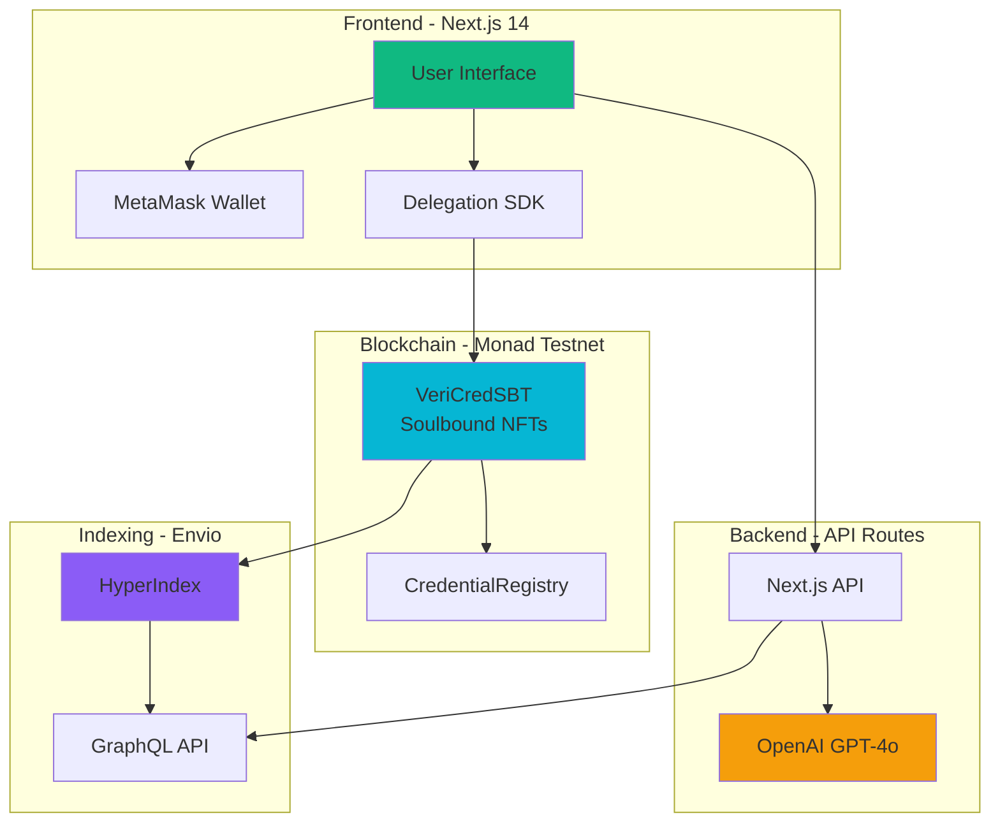

# VeriCred+ Documentation

> **Tamper-proof, AI-powered credential management on Monad blockchain**

Built for MetaMask x Monad x Envio Hackathon

---

## 📚 Documentation Index

This documentation provides comprehensive coverage of VeriCred+, from architecture to deployment to user guides.

### Core Documentation

1. **[Architecture Overview](./01-architecture-overview.md)**
   - System architecture diagrams
   - High-level data flows
   - Technology stack
   - Core components
   - User personas
   - Performance metrics

2. **[Smart Contracts](./02-smart-contracts.md)**
   - Contract architecture
   - VeriCredSBT (Soulbound NFT)
   - CredentialRegistry
   - DelegationManager
   - RiskAssessment
   - Deployment guide
   - Security considerations

3. **[Frontend Architecture](./03-frontend-architecture.md)**
   - Next.js 14 App Router structure
   - Component architecture
   - MetaMask integration
   - Delegation setup
   - State management
   - API routes

4. **[Envio Indexer](./04-envio-indexer.md)**
   - Indexer configuration
   - GraphQL schema
   - Event handlers
   - Query examples
   - Performance optimization
   - Deployment guide

5. **[AI & Delegation Flow](./05-ai-delegation-flow.md)**
   - Smart Account creation
   - Delegation with caveats
   - AI fraud detection
   - OpenAI integration
   - Security model
   - Complete issuance flow

6. **[API Reference](./06-api-reference.md)**
   - REST API endpoints
   - GraphQL queries
   - Request/response formats
   - Error handling
   - Client libraries
   - Rate limits

7. **[Deployment Guide](./07-deployment-guide.md)**
   - Smart contract deployment
   - Envio indexer deployment
   - Frontend deployment
   - Environment configuration
   - CI/CD setup
   - Production checklist

8. **[User Guides](./08-user-guides.md)**
   - Issuer guide (step-by-step)
   - Holder guide (credential management)
   - Verifier guide (instant verification)
   - Troubleshooting
   - FAQ

---

## 🚀 Quick Start

### For Developers

```bash
# Clone repository
git clone https://github.com/your-org/vericred-plus.git
cd vericred-plus

# Install dependencies
pnpm install

# Start frontend dev server
cd frontend
pnpm dev

# Deploy smart contracts (Monad Testnet)
cd contract
forge script script/Deploy.s.sol --broadcast

# Start Envio indexer locally
cd envio-indexer
envio dev
```

See [Deployment Guide](./07-deployment-guide.md) for detailed instructions.

### For Users

1. **Issuers**: [Issuer Guide](./08-user-guides.md#part-1-issuer-guide)
2. **Holders**: [Holder Guide](./08-user-guides.md#part-2-holder-guide)
3. **Verifiers**: [Verifier Guide](./08-user-guides.md#part-3-verifier-guide)

---

## 🏗️ Architecture at a Glance



**Key Features**:
- 🎯 **AI-Powered Issuance**: GPT-4o analyzes fraud risk before credential issuance
- ⚡ **Instant Verification**: Sub-second queries via Envio HyperIndex
- 🔐 **Soulbound NFTs**: Non-transferable credentials on Monad blockchain
- 🤖 **Delegated Automation**: MetaMask Smart Accounts with time-bounded permissions
- 🌐 **Gasless UX**: Backend covers gas costs via delegation

---

## 📖 Documentation Structure

### By Role

#### 🏢 For Product Managers
- [Architecture Overview](./01-architecture-overview.md) - Understand system design
- [User Guides](./08-user-guides.md) - See user flows

#### 👨‍💻 For Developers
- [Smart Contracts](./02-smart-contracts.md) - Contract implementation
- [Frontend Architecture](./03-frontend-architecture.md) - Frontend codebase
- [API Reference](./06-api-reference.md) - API endpoints

#### 🔧 For DevOps
- [Deployment Guide](./07-deployment-guide.md) - Deploy all components
- [Envio Indexer](./04-envio-indexer.md) - Indexer setup

#### 🧪 For AI/ML Engineers
- [AI & Delegation Flow](./05-ai-delegation-flow.md) - AI fraud detection

#### 👥 For End Users
- [User Guides](./08-user-guides.md) - Step-by-step instructions

---

## 🎯 Key Concepts

### Soulbound NFTs (SBTs)
Non-transferable NFT credentials that are permanently bound to recipient's address. Prevents credential fraud through transfer.

**Learn more**: [Smart Contracts - Soulbound Implementation](./02-smart-contracts.md#_update---soulbound-implementation)

---

### MetaMask Smart Accounts
ERC-4337 account abstraction enabling gasless transactions and delegated permissions.

**Learn more**: [AI & Delegation Flow - Smart Accounts](./05-ai-delegation-flow.md#what-is-a-smart-account)

---

### Delegation with Caveats
Time-bounded, function-specific permissions granted to backend for automated credential issuance.

**Caveats**:
- `allowedTargets`: Only VeriCredSBT contract
- `allowedMethods`: Only mintCredential function
- `limitedCalls`: Max 100 credentials
- `timestamp`: Valid for 30 days

**Learn more**: [AI & Delegation Flow - Delegation Caveats](./05-ai-delegation-flow.md#delegation-caveats-explained)

---

### AI Fraud Detection
OpenAI GPT-4o analyzes recipient's on-chain history via Envio to generate fraud risk scores (0-100).

**Data Sources**:
- Total credentials held
- Revocation rate
- Prior issuer-recipient interactions
- Minting velocity patterns

**Learn more**: [AI & Delegation Flow - AI Analysis](./05-ai-delegation-flow.md#part-2-ai-fraud-detection)

---

### Envio HyperIndex
High-performance blockchain indexer providing sub-second GraphQL queries for instant verification.

**Performance**:
- Single credential: ~50ms (40x faster than RPC)
- Complex aggregations: ~80ms (125x faster)
- Real-time event processing: <1s lag

**Learn more**: [Envio Indexer](./04-envio-indexer.md)

---

## 🛠️ Technology Stack

### Frontend
- **Framework**: Next.js 14 (App Router)
- **Language**: TypeScript
- **Styling**: TailwindCSS, Framer Motion
- **Web3**: viem, wagmi, MetaMask Delegation Toolkit
- **Deployment**: Vercel

### Backend
- **Runtime**: Next.js API Routes
- **AI**: OpenAI GPT-4o
- **Data**: Envio GraphQL Client

### Smart Contracts
- **Language**: Solidity ^0.8.30
- **Framework**: Foundry
- **Network**: Monad Testnet (Chain ID: 10143)
- **Standards**: ERC-721 (Soulbound), AccessControl

### Indexing
- **Indexer**: Envio HyperIndex
- **Query**: GraphQL
- **Storage**: PostgreSQL

---

## 🔗 External Resources

### Project Links
- **GitHub**: https://github.com/your-org/vericred-plus
- **Demo**: https://vericred.vercel.app
- **Documentation**: https://docs.vericred.xyz

### Blockchain
- **Monad Testnet RPC**: https://testnet.monad.network
- **Block Explorer**: https://explorer-testnet.monad.xyz
- **Faucet**: https://faucet.monad.xyz

### Services
- **Envio Dashboard**: https://app.envio.dev
- **MetaMask**: https://metamask.io
- **OpenAI**: https://platform.openai.com

---

## 📊 Performance Benchmarks

| Metric | Target | Achieved |
|--------|--------|----------|
| **Onboarding Time** | < 15s | ✅ ~10s |
| **Verification Speed** | < 2s | ✅ ~0.5s |
| **Transaction Time** | < 5s | ✅ ~1s |
| **AI Analysis** | < 10s | ✅ ~3-5s |
| **Delegation Setup** | < 30s | ✅ ~20s |

See [Architecture Overview - Performance Metrics](./01-architecture-overview.md#performance-metrics)

---

## 🏆 Hackathon Tracks

VeriCred+ qualifies for multiple tracks:

### ✅ Best AI Agent
AI-powered fraud detection analyzing on-chain data via Envio before credential issuance.

**See**: [AI & Delegation Flow](./05-ai-delegation-flow.md)

---

### ✅ Best On-Chain Automation
Delegated credential issuance with time-bounded, function-specific permissions.

**See**: [AI & Delegation Flow - Delegation](./05-ai-delegation-flow.md#part-1-metamask-smart-accounts--delegation)

---

### ✅ Best Consumer App
Seamless UX with gasless transactions and instant verification.

**See**: [Frontend Architecture](./03-frontend-architecture.md)

---

### ✅ Most Innovative Delegation
Time-bounded access with multiple caveats (targets, methods, calls, timestamp).

**See**: [AI & Delegation Flow - Caveats](./05-ai-delegation-flow.md#delegation-caveats-explained)

---

### ✅ Best Use of Envio
Sub-second verification and AI data queries using Envio HyperIndex.

**See**: [Envio Indexer](./04-envio-indexer.md)

---

## 🤝 Contributing

We welcome contributions! Please see:
- [CONTRIBUTING.md](../CONTRIBUTING.md) - Contribution guidelines
- [CODE_OF_CONDUCT.md](../CODE_OF_CONDUCT.md) - Community guidelines
- [GitHub Issues](https://github.com/your-org/vericred-plus/issues) - Report bugs

---

## 📄 License

MIT License - See [LICENSE](../LICENSE) for details

---

## 🙏 Acknowledgments

Built with:
- **MetaMask Delegation Toolkit** - Smart Account delegation
- **Monad** - High-performance blockchain
- **Envio** - Blazingly fast indexing
- **OpenAI** - AI-powered fraud detection
- **Next.js** - Full-stack React framework
- **Foundry** - Smart contract development

---

## 📞 Support

### Get Help
- **Documentation**: You're reading it! 📖
- **Discord**: https://discord.gg/vericred
- **Email**: support@vericred.xyz
- **GitHub Discussions**: https://github.com/your-org/vericred-plus/discussions

### Report Issues
- **Bugs**: https://github.com/your-org/vericred-plus/issues
- **Security**: security@vericred.xyz (for vulnerabilities)

---

## 🗺️ Roadmap

### Phase 1: MVP (Current)
- ✅ Soulbound credential NFTs
- ✅ AI fraud detection
- ✅ Delegated issuance
- ✅ Instant verification

### Phase 2: Enhancements (Q2 2025)
- [ ] Multi-chain support (Polygon, Arbitrum)
- [ ] Batch credential issuance
- [ ] Advanced AI models
- [ ] Mobile app

### Phase 3: Enterprise (Q3 2025)
- [ ] White-label solution
- [ ] Custom credential templates
- [ ] API rate limiting & authentication
- [ ] SLA guarantees

### Phase 4: Decentralization (Q4 2025)
- [ ] Decentralized AI oracles
- [ ] DAO governance
- [ ] Token-gated features
- [ ] Cross-chain bridges

---

*VeriCred+ - Making credentials tamper-proof, verifiable, and AI-secured* 🛡️

---

**Last Updated**: January 2025
**Version**: 1.0.0
**Status**: Hackathon Submission 🚀
